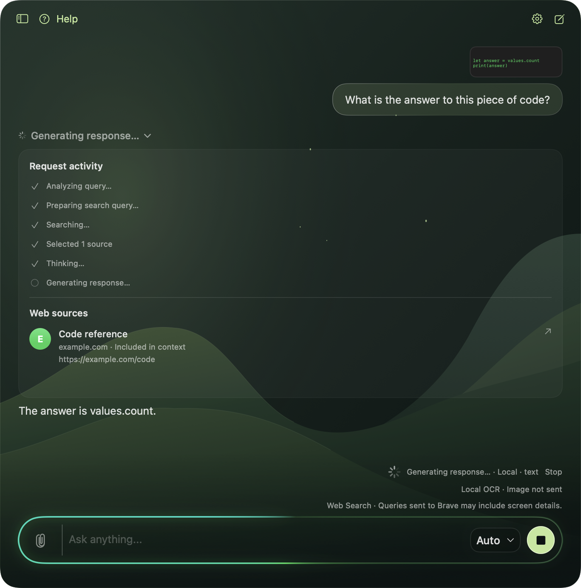

# Assistant activity and live sources

Implemented on top of `f03564e`, the latest `origin/main` at implementation time,
including the compact Liquid Glass app and colored slash commands.

The assistant shows actual preparation, query refinement, search, source collection,
model waiting, and response generation stages. Click the status to open its activity
panel. The same control stays available during streaming and on the completed reply.
Expansion follows the request when its pending row becomes an accepted message.
Stop and errors end the indicator; late events cannot update a replacement request.

Sources selected for the model prompt appear before the first response fragment.
Each selected unique URL contributes once to the count. Retrieval candidates remain
hidden while evidence is being fitted. Rows show a colored site initial, title, hostname, and link. Site
colors remain consistent within a request, with collisions resolved across the first
eight sites. The source list scrolls independently when it grows. Only excerpts that fit
into model context are shown; excluded candidates never appear as citation sources.
A collected excerpt does not mean the assistant visited or verified the full page.

## Shared event contract

`AssistantActivityEvent` provides phase, sources-discovered, and sources-selected
updates. `AssistantActivity` reduces them into a UI snapshot. The view model applies
updates on the main actor only while the emitting request still owns the generation.
`AssistantActivityView` is independent of the inference provider.

`WebSearchProvider` has an activity callback overload. Existing batch providers use
the default adapter; incremental providers can override it and report discovery as
it happens. Brave's current LLM Context endpoint returns one batch. Discovery updates
the processing phase; the visible source count/list updates after context selection. There are no timers simulating progress or individual page
fetches. Local text, local vision, Screen with search, Auto, and cloud with search
all use the same callback and reducer.

`ChatEvent.activity` also accepts normalized events directly from cloud adapters.
The Screen text-stream adapter forwards these events without treating them as answer
text. Existing cloud clients receive orchestration status today; provider-specific
native tool/reasoning telemetry can be mapped to the same event without UI changes.
File requests show model waiting and answer generation; per-file tool activity remains
in the existing File Mode controls.

Activity snapshots are session-only and excluded from message serialization and
provider text. Existing retained source references still save with the reply. Reopened
chats expose those sources through the same expandable panel, without inventing a
historical processing timeline. Search snippets and intermediate queries stay transient.

## Verification

Regression tests exercise incremental discovery before response text on local and
cloud routes, URL deduplication, source selection, stable colors, cancellation and late
events, provider event forwarding, existing history compatibility, and compact light
and dark renderings. Native full-app tests click the activity control and verify its
rendered source panel alongside the current composer and streaming scroll behavior.

The images use deterministic local response/search fixtures, not live Brave or cloud
requests. They were rendered through the repository's isolated app-hosted test helper.
The unsigned verification app was not launched for interactive Screen testing.

Build and static analysis passed. After the context-aware retrieval update, the full
suite ran 424 tests with nine optional skips and zero failures.
This screenshot is an intentionally versioned UI reference; build and test products
remain outside the repository.

