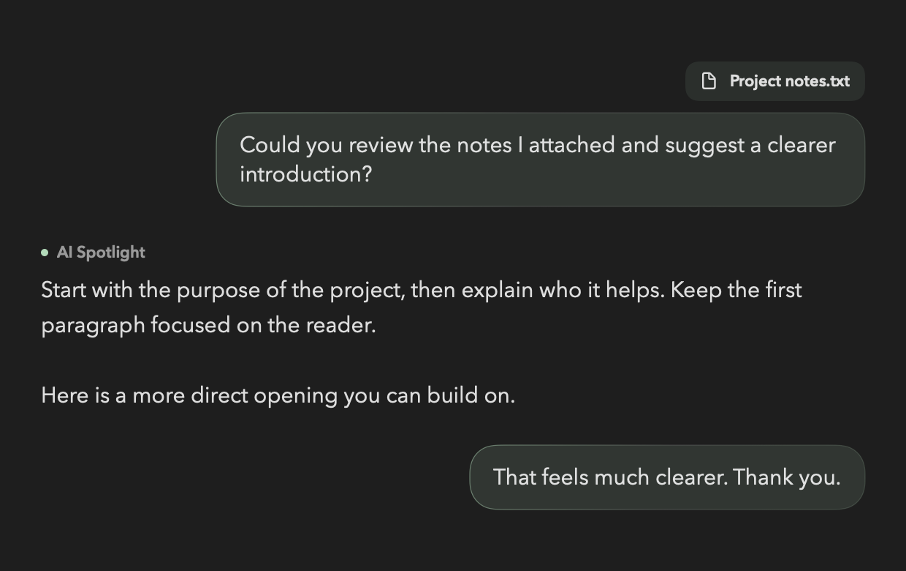
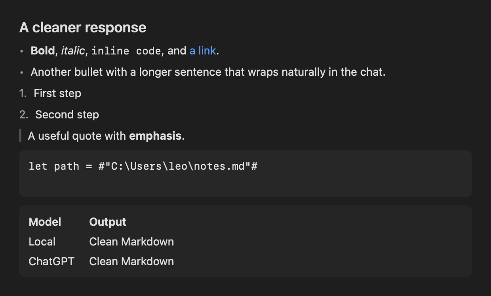
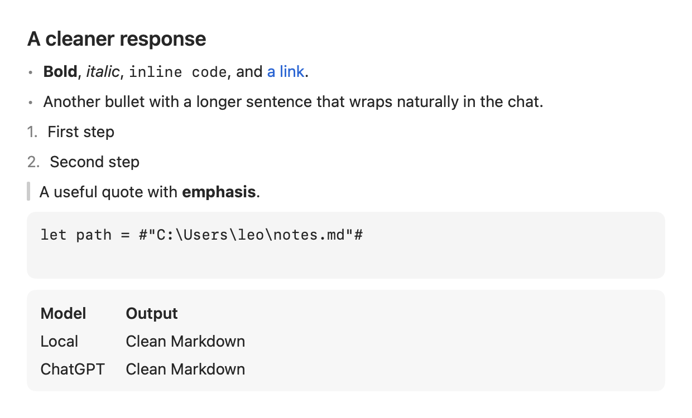

# Chat presentation and attachment lifecycle

User messages appear immediately as sage bubbles aligned to the right. The macOS system sans-serif
font is used for conversation text and the composer. Assistant messages use the
available chat width, with paragraph spacing preserved. File and folder names
appear above the corresponding user bubble; screenshot previews use the same
placement.

The supplied leaf appears only while waiting for the first visible assistant
fragment. It disappears as soon as response text arrives and does not reappear
between chunks. The composer glow remains active until the request finishes.

Preparing or searching requests expose an outgoing presentation message
synchronously, before the first model token. The underlying draft remains
recoverable until acceptance, so setup errors and cancellation still preserve
unsent text and screenshots. The composer hides that retained draft while the
pending bubble is visible. Pending presentation state never reaches chat storage
or model history, cannot duplicate the accepted message, and clears on Stop or
request failure.

The file button is white when idle and green during selection or with draft
attachments. It opens the native file/folder picker. Sending transfers the
attachment summary into the message and clears the composer's selection. The
active request keeps its already-created workspace until completion; the next
draft has no implicit file grant. Existing edit review, undo and protected-write
consent remain available. The explicit cloud-handoff action restores its original
selection as a draft; it does not silently send another request. Saved message
summaries contain names and file/folder types, not paths, bookmarks or contents.

Regression coverage includes immediate outgoing visibility, first-text leaf
removal, Stop cleanup, attachment consumption and persistence, protected handoff,
file edits and undo, native bubble rendering, and scrolling through the leaf's
layout transition. The previous pink-icon rendering assertion now checks green
because the requested color changed.

The image is a native rendering with synthetic messages from before the system-font update. The signed app's privacy
setting excludes the panel from computer screenshots; live behavior is checked
through its accessibility hierarchy.

Final verification: build and static analysis passed; 392 tests completed with
nine optional skips and zero failures. In the signed app, local Gemma showed
the outgoing question during preparation, displayed the leaf while waiting,
and removed it when the response arrived. The book-and-pen check returned 5 kr.

## Markdown responses and startup history

Assistant responses from every provider now use Foundation's full Markdown parser
and native SwiftUI blocks. Headings, bulleted and numbered lists, emphasis,
inline code, fenced code, links, blockquotes, and tables retain the existing
14-point chat typography and light/dark surfaces. Code and tables scroll
horizontally when necessary.

A display-only normalizer repairs clear escaped headings, list markers, paired
emphasis, and escaped links, plus non-breaking/invisible whitespace in prose.
Ambiguous escapes are retained. Fenced/indented code, inline code, and paths are
protected; parser-side escaping also preserves punctuation backslashes in plain
paths. Stored messages, user bubbles, and provider streaming events are unchanged.
All provider instructions request standard Markdown. Embedded local models receive
that guidance in their first user turn because some bundled chat templates do not
support a system role; token counting includes the same guidance.

The sidebar starts hidden. Show History and double-Control still toggle it while
preserving the selected conversation and draft.

Regression tests cover normalization, partial streamed Markdown, literal paths,
semantic blocks and links, provider guidance, light/dark native snapshots, and
hidden startup followed by repeated history toggles.

