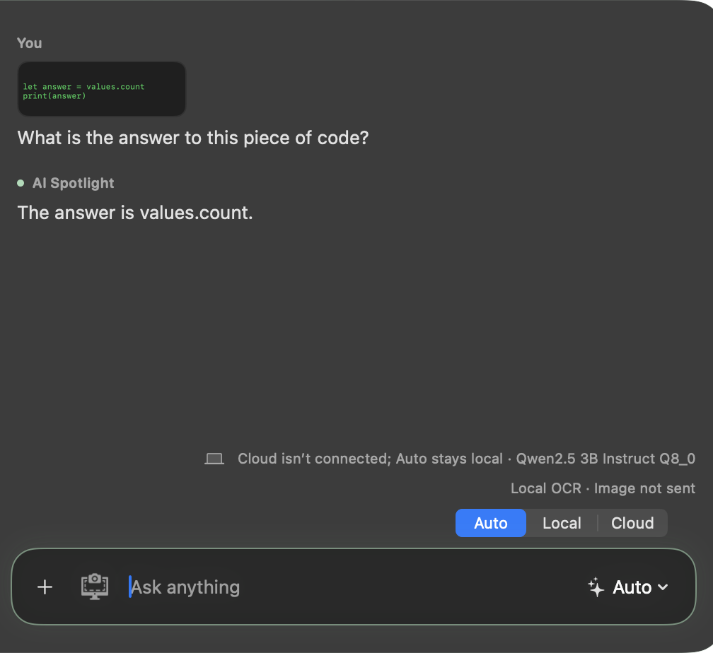

# Chat scrolling and botanical glass accents

Implemented on 2026-09-06, based on `e12305a` (`feat/file-mode`).

## Scrolling

The old layout observer unconditionally scrolled to the bottom after every lazy
stack size change. Scrolling into older rows causes fresh measurements, so the
observer could undo the reader's scroll about 30 milliseconds later.

The native observer now retains whether the reader is following the latest
message. Trackpad/scroller tracking suspends following before movement begins;
ordinary offset changes also detect wheel and keyboard navigation. Leaving the
bottom cancels queued corrections, and each correction rechecks the current
intent before executing. Returning within two points of the bottom restores
following. Document geometry observations distinguish growth/resizing from
navigation and keep the resume behavior current. Observers and queued work are
removed when the view leaves its window. Session identity and lazy rendering
remain unchanged.

## Appearance

Sage accents add fine outer/palette borders, a composer focus ring and soft glow,
a selected-chat marker, and an assistant label dot. The welcome symbol gets a
quiet circular treatment. Rounded greeting/role typography and short hover/press
feedback add warmth without changing the established glass layout. Colors adapt
to light/dark appearance; Reduce Motion disables the new motion effects.

## Verification

- `scripts/verify-xcode.sh build`: passed.
- `scripts/verify-xcode.sh test`: 340 tests, seven existing opt-in runtime skips,
  zero failures.
- `scripts/verify-xcode.sh analyze`: passed.
- Focused `ScreenViewTests`: 13 passed.
- Native flipped/unflipped scroll fixtures cover a tiny movement racing queued
  layout work, content growth while reading, returning to the bottom, and live
  scrolling. The real 40-message SwiftUI panel regression checks an eight-point
  scroll during streaming and access to the oldest messages.
- The development-signed app was built and run from Xcode. Its accessibility
  hierarchy was inspected. The privacy-excluded panel does not appear in computer
  screenshots, so this is not claimed as a successful manual visual scroll test.

The image below is a native test-rendered detail view with synthetic content,
cropped to omit the sidebar's separate glass surface, which bitmap caching does
not capture reliably. It demonstrates the focused composer and message styling;
it is intentionally retained as review evidence. Full signed-app appearance and
physical trackpad feel still benefit from user review. GitHub CI is reported in
the pull request.

