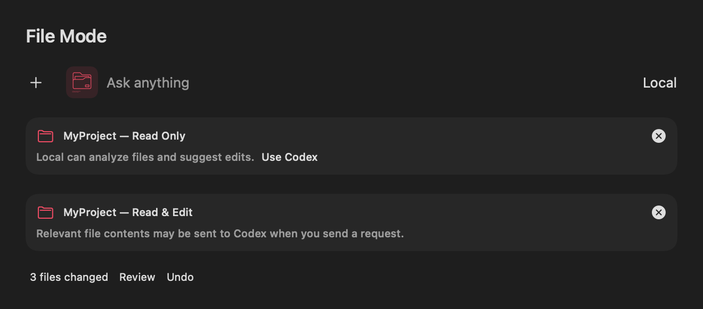
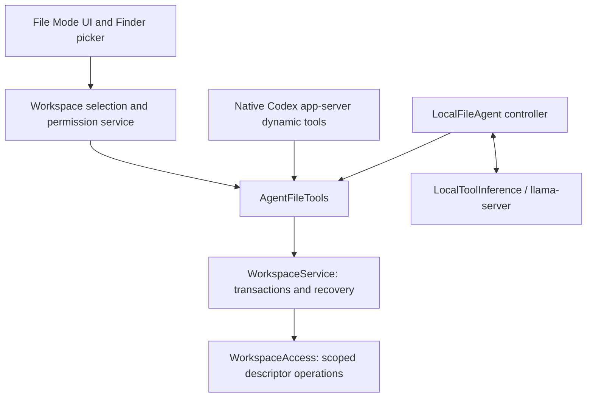

# File Mode

File Mode starts only after **+ → Files** or **Shift + Option + F** opens the macOS file/folder picker. Both entry points call `FileModeCoordinator.activate`. Multiple files and folders can be attached; removing the last attachment returns to ordinary chat. A new chat starts without attachments. Existing conversations retain attachment metadata and bookmarks, but scopes open only when a File Mode request starts.

The input displays a pink File Mode icon, each attachment and its access level. Local and Auto requests stay on the Mac with **Read Only** access. **Use Codex** displays a cloud-content disclosure and selects Codex; the user must still send the next request. There is no automatic provider fallback. Cloud File Mode currently supports the existing ChatGPT/Codex connection. Other cloud providers remain available for ordinary chat.



## Shared architecture



`WorkspaceAccess` is the only agent-facing filesystem implementation. `WorkspaceService` owns each task's authority and recoverable changes. Both providers call the same nine tools: `list_files`, `read_file`, `search_files`, `get_file_metadata`, `apply_patch`, `write_file`, `create_file`, `move_file` and `delete_file`. Read-only sessions receive only the first four definitions, and the service independently rejects every mutation. The reserved `AgentCapability.runCommand` and `.runTests` cases provide a future extension point; no command tool is currently exposed.

## Permission boundaries

- The picker creates security-scoped bookmarks for canonical selected locations. Scope lifetimes are balanced. Restoring a conversation does not enumerate its attachments.
- A file attachment authorizes exactly that leaf, not siblings or its parent folder. Multiple attachments have explicit numbered mount names. Redundant selections are normalized.
- Absolute paths, NULs, `..`, descendant symlinks, hard-linked file contents, special files and writes under `.git`, `.codex` or `.agents` are rejected. Internal descendant symlinks are deliberately rejected too; users can attach their target explicitly.
- POSIX `realpath`, verified root identities, directory descriptors, `openat`/`O_NOFOLLOW` and `F_GETPATH` checks enforce the boundary and reject case aliases for mutations. Atomic replacements do not follow destination links.
- No Full Disk Access permission is requested. Existing macOS permissions still apply. AI Spotlight's current app target is not App Sandbox-enabled; security-scoped bookmarks are used for picker-granted locations, and the shared service also enforces scope inside the app. A future App Sandbox distribution must validate individual-file deletion recovery with its entitlement configuration; restoring a deleted leaf never silently grants its parent.
- File names and file/tool contents are treated as untrusted data. They cannot grant permissions, choose a provider, run commands or register tools.
- Removing attachments is disabled during a task. Stop revokes the task's authority and cancels pending deletion confirmation; queued operations check cancellation and authority. Completed edits remain reviewable.

This is a boundary against model-requested access and link/path escapes. It does not isolate the app from another malicious process already running as the same macOS user, or provide database-style locking against simultaneous external editors. Detected external changes produce a conflict instead of overwriting newer user work.

## Codex

`CodexSubscriptionClient` retains the existing authentication, account checks and streamed response events. File requests use the selected folder as the native thread `cwd`, `workspace-write`, a restricted turn policy and native `DynamicToolSpec`/`item/tool/call` requests. For a single file, its parent is cwd metadata only.

`environments: []` disables built-in filesystem/execution environments. Edits travel through native dynamic tools to the shared journal; built-in `apply_patch` and shell execution cannot bypass it. The app declines direct command/file-change approvals and returns no additional filesystem/network grants. Deletion through `delete_file` requires a visible user confirmation. Native call IDs are deduplicated within a thread, and handlers are removed when the turn ends.

Before enabling File Mode, the app generates the installed app-server's experimental JSON schema and checks the documented environment-disable and dynamic-tool contract. Older incompatible runtimes fail closed with an update message. Ordinary chat keeps its text-only, read-only parameters and has no File Mode handler or attachment cwd. Plugins, hooks, host skill discovery, project instructions and other execution surfaces are disabled in the app's isolated Codex configuration.

Some app-server versions do not implement the newer `readOnlyAccess` sandbox field. The filesystem boundary does **not** depend on that field: disabling native environment access and validating every dynamic tool operation in `WorkspaceAccess` are required on all supported versions. Workspace sandboxing alone would otherwise permit broad reads.

References: [Codex app-server](https://learn.chatgpt.com/docs/app-server). The executable's generated schema is the runtime authority; experimental fields may change.

## Local inference and editing trust

`LocalFileAgent` owns the bounded inference/tool loop. `LlamaCPPModelEngine` remains unchanged and inference-only. `LlamaServerVisionEngine` implements `LocalToolInference` for both text GGUF and existing vision models, using llama-server's native OpenAI-compatible `tools` and `tool_calls` with `--jinja`. Assistant text is never parsed for embedded JSON commands.

Each step counts the actual rendered prompt tokens, limits the completion and rejects incomplete responses. Tool outputs return as structured tool messages. IDs are normalized for history, including runtimes that reuse an ID in separate completions. The loop permits at most 16 steps and eight calls in one response. Inference and filesystem dispatch remain separate.

`LocalFileCapabilities.production` has an intentionally empty, release-controlled artifact-hash allowlist. Model size, a model-generated claim or a catalog capability flag cannot enable writes. Adding a tested artifact to this allowlist is an explicit future release decision, not a user-facing trust toggle. The real-model write smoke test creates a test-only writable service and does not change production policy.

Settings → Local Models → **Install Local File Tools** installs the existing pinned, checksum-verified llama-server runtime (about 11 MB) when necessary. Already installed compatible model runtimes are reused. Setup downloads the runtime only; it does not transmit attachments. Model inference binds to loopback with an ephemeral API key, runs offline and is unloaded after the file task. Models still need a compatible chat template and reliable tool-calling behavior; unsupported or malformed output fails without executing text as a command.

Reference: [llama.cpp function calling](https://github.com/ggml-org/llama.cpp/blob/master/docs/function-calling.md).

## Changes and undo

Before the first mutation of each affected path, the service writes a durable before/after journal in `~/Library/Application Support/AI Spotlight/File Changes`. Recovery files have mode `0600` inside a `0700` directory. These local recovery copies can contain sensitive file contents and remain until removed; this version does not prune them automatically. Bookmarks and conversation IDs are included; full attachment contents are not stored in chat messages by default.

Transactions preflight all paths and mutations before writing, preserve the first before-image across subsequent tool calls, and apply files using atomic replacements. Failed multi-file operations roll back completed steps when the files still match the operation's after-images. Undo restores modified/deleted files, removes new files and restores both sides of a move. Ownership, ordinary permission bits, macOS ACLs and writable extended attributes, including Finder metadata, are retained. If ownership or access rules cannot be restored, replacement fails before committing. Temporary copies have their inherited ACLs cleared before content is written. Kernel-generated authorization/provenance records, inode identity and timestamps are not restored as historical metadata.

After a task, **N files changed → Review / Undo** appears in its conversation. Review shows plain-language file statuses with optional before/after previews. Settings → Local Models → **Review Saved File Changes** also exposes recovery after restart or conversation deletion. Undo checks for newer external changes and stops on conflicts. If a rollback cannot complete safely, its recovery journal remains available instead of silently discarding the before-images. Earlier successful tool operations remain visible if a later independent tool call fails.

## Initial limits

- At most 16 attachments; regular files up to 2 MiB; UTF-8 text and text extraction from PDFs up to 200 pages. Office/binary document editing is not supported. A text export can be attached instead.
- `read_file` returns up to 32,000 characters per call with an offset for continuation. Search reads on demand, with a 4 MiB text budget, 2,000 entries, 500 entries per directory, depth 16 and 100 matches. Large results must be narrowed by path. Listings are capped at 500 entries.
- Writes create/replace UTF-8 files; parent directories must already exist. Moves/deletes affect regular files, not entire directory trees. The journal is capped at 64 MiB of file data and attributes per task. A move counts both affected paths.
- File Mode runs separately from Screen/Web Search for now. Enabling it clears those draft tools; combining them later is blocked with a clear message.
- There is no shell, test runner, arbitrary network tool, automatic repository upload or autonomous local editing in production.

## Verification

Use the repository's isolated unsigned verification helper (do not launch its unsigned app for interactive Screen testing):

```sh
scripts/verify-xcode.sh build
scripts/verify-xcode.sh test
scripts/verify-xcode.sh analyze
```

`WorkspaceTests`, `FileAgentTests` and `FileModeUITests` cover picker flows, files/folders, the native panel shortcut including Option-F's `ƒ`, conversation persistence, local/cloud tool dispatch, ordinary chat, traversal/symlinks/hardlinks, read-only policy, preflight, rollback, snapshots, restart recovery, modified/deleted/new/moved files, metadata, conflicts and native UI rendering. The screenshot is rendered from native SwiftUI fixtures.

`scripts/verify-file-mode-codex.py` exercises a real installed app-server with an isolated configuration and a loopback fixture Responses provider. It verifies native dynamic-tool dispatch, returning tool results to the next model step, turn completion and the absence of direct filesystem/shell tools. It requires no cloud account or user file contents. Set `AI_SPOTLIGHT_CODEX_PATH` to select the executable.

The optional real llama.cpp smoke test is enabled with:

```sh
TEST_RUNNER_AI_SPOTLIGHT_FILE_TEST_MODEL_PATH=/absolute/path/to/model.gguf \
  scripts/verify-xcode.sh test '-only-testing:AI SpotlightTests/FileModeRuntimeTests'
```

The test reads a disposable fixture, writes a precisely specified edit through the shared tools and verifies Undo. Qwen 2.5 3B Q8 passed this test locally; an earlier ambiguous prompt produced the wrong edit. This is integration evidence, **not** an editing-trust qualification. Cloud integration tests use deterministic native transport fixtures and the real app-server probe, rather than paid/live cloud inference.
