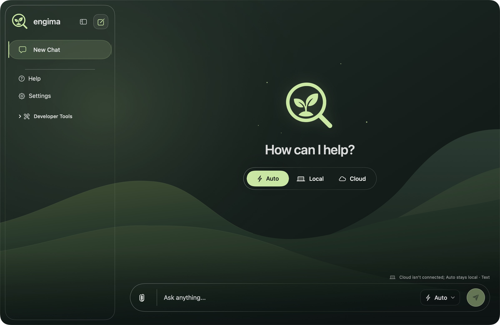
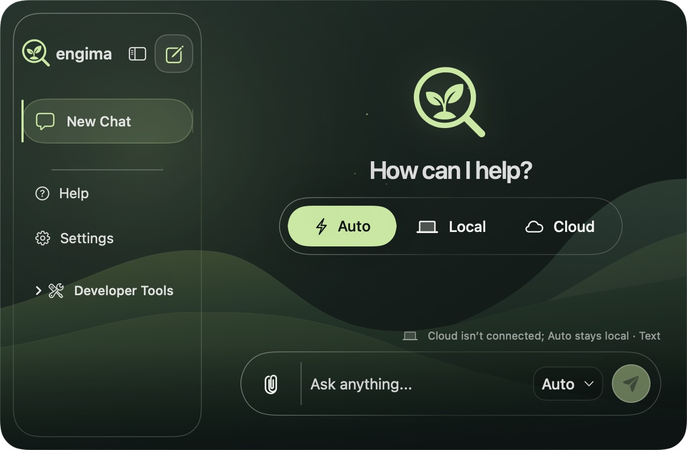
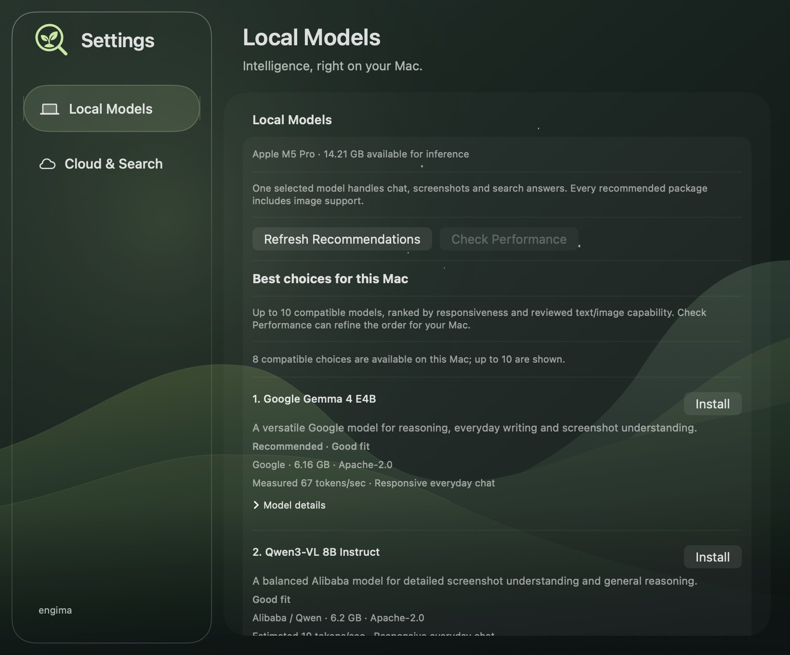
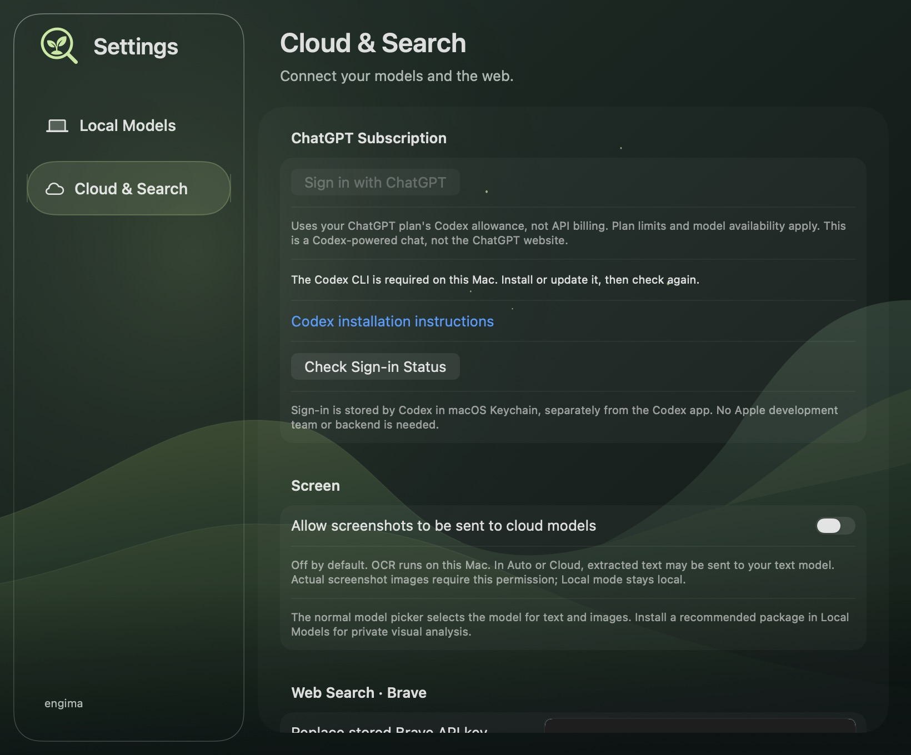
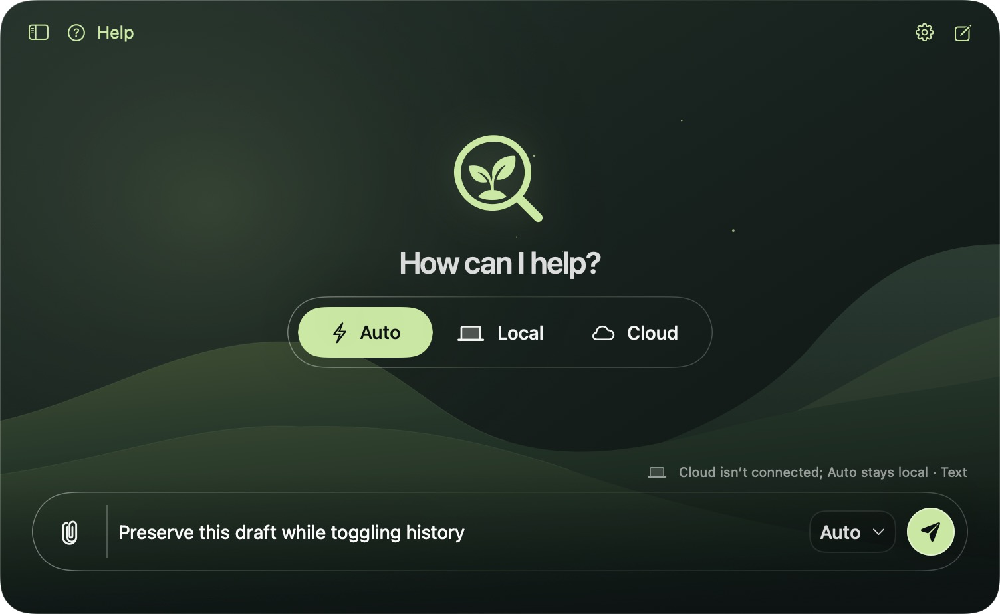

# Liquid Glass interface

Design source: [AI-Spotlight — Nature UI & Agent Handoff, Liquid Glass alternative](https://www.figma.com/design/0EhvFOJ9c1p6G71ZF77y5U/AI-Spotlight?node-id=16-122).

The 1200 × 780 reference uses a continuous forest backdrop beneath an inset navigation surface, a sage selected state, a large welcome identity, and a capsule composer. The original Forest variant is not used. The app uses the engima bot name and retains its existing logo, thinking animation, capture behavior, routing, sessions, and credentials.

## Implementation

- `ForestBackdrop` renders the exact exported Figma SVG, bundled in the asset catalog. `TemplateAttachment` is the exact attachment glyph from the composer, replacing the former folder control in both the composer and attachment menu.
- `SpotlightAccent` and `AccentColor` preserve the design's #C4E99C sage. `NatureGlassSurface` uses native macOS 26 Liquid Glass with a single material plane per container. Selected controls and model buttons use fills within that plane.
- The dark appearance follows the supplied design. Reduce Transparency uses opaque surfaces; existing Reduce Motion behavior remains in place. Glass enable/clarity preferences still control the chat surfaces.
- Sidebar width follows the compact 27% proportion up to 288 points, with a 200-point lower bound. At widths below 900 points, the brand, history spacing, and composer controls become compact. The supported minimum remains 640 × 420. New installations open at 1200 × 780; stored window sizes are preserved and fitted to the active display.
- Settings uses the same forest, inset navigation, and sage selected rows, retaining the existing Local Models and Cloud & Search forms. Help, model onboarding, and file review use the shared presentation theme.
- The composer includes a visible Send/Stop control wired to the existing request lifecycle. The Mode & Model button opens the existing model palette; routing remains available in the welcome screen and palette throughout a conversation.

## Verification

The screen regression tests retain their checks for visible composer bounds, sidebar bounds, repeated captures, blocked requests, and long streaming conversations. They inspect the inset scroll surface instead of requiring the removed `NSSplitView` implementation. Visual attachments cover 1200 × 780 and 640 × 420 welcome states, settings, and existing chat/capture states.

Run the project-prescribed build, test, and analyze actions using `scripts/verify-xcode.sh`. Rendered test previews are in `/tmp/AI-Spotlight-Glass-*.png` and the test result bundle. Native glass is composited by macOS, so cached test previews do not reproduce all live optical effects. Interactive Screen testing must continue to use the stable development-signed app from Xcode, as described in AGENTS.md.

## Review previews

These four curated test previews are intentionally committed as design review documentation (not build products). Test data is synthetic; no credential values are present. The full-resolution PNGs and other test outputs remain outside the repository.

Local verification: build passed; 396 tests executed, 9 existing opt-in integration tests skipped, 0 failures; static analysis passed. The optional real-model, signed-in Codex, and live screen-capture tests require their documented local configuration.

## Compact engima refinement

The visible bot identity is `engima`; assistant replies begin directly with their content. Welcome typography is 32 points (23 in compact mode), chat text is 14 points, and the hero mark, routing controls, sidebar rows, and composer controls use smaller dimensions. Settings is 820 × 680.

While the chat panel is active, tap and release Control twice within 0.4 seconds to toggle chat history. Both Control keys work. Holding Control, adding another modifier, typing a key/chord, clicking, or leaving the panel cancels the sequence. The shortcut also works while editing the draft and does not consume text input. Sidebar visibility lasts for the current app session.

The sidebar has a visible hide button. When hidden, the chat toolbar retains Show History, Help, Settings, and New Chat controls. Existing sessions and drafts survive hiding/restoring the sidebar. Regression tests exercise the gesture through the native window and render the hidden state with Help visible.

