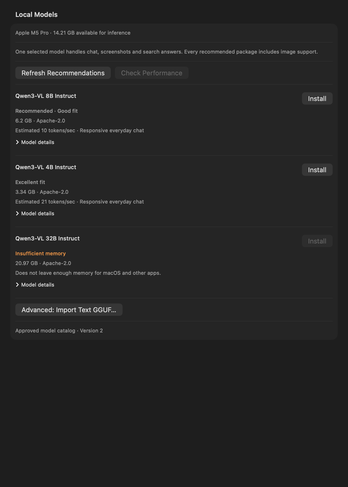

# One local model for text and images

AI Spotlight detects the Mac and recommends one complete model package for chat,
screenshots, reasoning and search answers. Use **Find a Model for This Mac** in the
normal model picker or **Settings → Local Models**. Recommended, Faster and Smarter
use the same hardware assessment. There is no separate image-model selection.

**Install** downloads the model, its matching vision encoder/projector, and the
reviewed llama.cpp runtime with its libraries. All components have immutable URLs,
exact byte counts and SHA-256 checksums. Users never select component files during
normal setup. The complete package becomes selected only after installation commits.
The same picker also labels existing text-only models honestly.

## Catalog reviewed on 2026-09-06

The catalog contains official **Qwen3-VL Instruct** GGUF packages, using Q4_K_M
language weights and the matching F16 vision encoder. All three are Apache-2.0.
The Instruct variants support ordinary text as well as images; the runtime uses
the model's Jinja chat template. Thinking output is disabled for bounded,
user-facing answers and hidden query planning.

| Package | Complete download¹ | Estimated runtime memory² | Minimum Mac memory |
|---|---:|---:|---:|
| Qwen3-VL 4B Instruct | 3.34 GB | 6.85 GiB | 12 GiB |
| Qwen3-VL 8B Instruct | 6.20 GB | 10.04 GiB | 24 GiB |
| Qwen3-VL 32B Instruct | 20.97 GB | 27.42 GiB | 64 GiB |

¹ Decimal bytes, including the arm64 runtime; x64 differs by less than 0.1 MB.
² Capacity estimates, not measurements of currently free memory or model quality.
Every candidate must also pass the actual Mac's memory, Metal, speed and disk gates.
An 8 GB Mac receives an explanation instead of a limited starter vision download.

Qwen's model cards describe general text generation, document understanding,
spatial interpretation and visual reasoning, and publish separate text and visual
evaluations. The catalog uses these capabilities and the runtime's implemented
`qwen3vl` architecture, not a name containing “VL”. Editorial quality priorities
76/84/90 rank this selected family; they are not benchmark scores and do not imply
that parameter count guarantees better answers. F16 vision encoders avoid adding
another quantization variable to visual processing. The 4B package is the smallest
reviewed choice in this release; no SmolVLM package is newly recommended.

Other families, quantizations, and newer releases require their own review of
licenses, exact artifacts, templates, memory and runtime behavior before admission.
The 8B and 32B packages share the implemented dense Qwen3-VL runtime path, with
separate architecture metadata and matched encoders. Their download metadata was
verified; they have not both been executed on this developer Mac. The controlled
4B results and remaining quality limits are in [verification](Screen-Search-Verification.md).

Primary sources:

- [Qwen 4B official GGUF card and files](https://huggingface.co/Qwen/Qwen3-VL-4B-Instruct-GGUF/tree/1cd86afb9a95c410a6038ab3b40d8b578c892266)
- [Qwen 8B official GGUF card and files](https://huggingface.co/Qwen/Qwen3-VL-8B-Instruct-GGUF/tree/f982a07559d4a2f6c8744d840bf6fccab30eea96)
- [Qwen 32B official GGUF card and files](https://huggingface.co/Qwen/Qwen3-VL-32B-Instruct-GGUF/tree/e3e1fe0c76de7ee58ea65db420c643adfe2e457c)
- [Qwen3-VL documentation and Apache license](https://github.com/QwenLM/Qwen3-VL)
- [4B architecture configuration](https://huggingface.co/Qwen/Qwen3-VL-4B-Instruct/blob/main/config.json), [8B configuration](https://huggingface.co/Qwen/Qwen3-VL-8B-Instruct/blob/main/config.json), [32B configuration](https://huggingface.co/Qwen/Qwen3-VL-32B-Instruct/blob/main/config.json)
- [llama.cpp b10797 release and publisher SHA-256 digests](https://github.com/ggml-org/llama.cpp/releases/tag/b10797)
- [Pinned Qwen3-VL implementation](https://github.com/ggml-org/llama.cpp/blob/b10797/src/models/qwen3vl.cpp)
- [Pinned server protocol and options](https://github.com/ggml-org/llama.cpp/blob/b10797/tools/server/README.md), [multimodal documentation](https://github.com/ggml-org/llama.cpp/blob/b10797/docs/multimodal.md)

## Hardware policy

Detection reads physical memory, Apple Silicon, Metal/unified memory, CPU resources,
non-purgeable free disk, low-power mode and Metal working-set/buffer limits. No
serial number is collected. The inference budget remains the smallest of:

- 60% of physical memory;
- physical memory minus the larger of 4 GiB or 25% for macOS and other apps;
- 80% of Metal's recommended working set, when present.

For these packages, estimated memory is `1.2 × (language weights + vision weights)
+ full F16 KV cache + 2 GiB`. The cache uses the actual 8,192-token allocation:
`layers × 8 KV heads × 128 head dimension × 4 bytes for K+V × context`.
4B/8B have 36 layers; 32B has 64. The additional reserve covers vision activations,
compute buffers, runtime and application overhead. Image input is bounded to
4,096 tokens and the preprocessor's existing 1,568-pixel longest edge. The runtime
cannot silently increase context or allocate a separate 8 GiB prompt cache.

Weights, encoder and runtime all count toward disk admission:
`2 × complete download + 2 GiB`. Free disk is checked again before installation.
Installed candidates avoid a new-download disk gate for selection, while an actual
update still checks the full required space. Apple unified-memory Metal and CPU
execution are supported; discrete Metal remains excluded from recommendations.
Metal buffer limits apply to a conservative largest-tensor bound.

Safety gates precede ranking. Recommended requires an estimated/measured 8 tokens/s
and a first token within 5 seconds; Faster must use less memory and be at least
20% faster. Smarter permits 3 tokens/s and 12 seconds. Missing tiers stay absent.
The speed estimate is a conservative CPU/acceleration/weight-size heuristic for a
reference text prompt. Image encoding and cold model loading add latency.

After installation, **Check Performance** measures a fixed public text prompt on
the selected runtime with 64 generated tokens and a 60-second generation deadline.
The multimodal runtime reports actual prompt/generation token counts and speeds;
first-token timing starts after loading. Combined application/server resident
memory is sampled every 20 ms and after completion. This conservative RSS sum can
double-count shared library pages; it is not a continuous OS high-water mark or a
measurement of every possible image. The image/cache memory floor still applies.

Benchmark failures/cancellation keep the verified installation. Measurements are
stored locally and scoped to runtime build, hardware, power mode, checksum and
context; they expire after 90 days. Exact measurements override speed estimates and
can increase the memory requirement. Same-architecture calibration is bounded to
twice the resource prior. The embedded engine remains for legacy text models only.

## Installation, upgrades and migration

Transfers report cumulative received bytes across all three artifacts, reject
oversized responses while receiving, and verify exact size and checksum. After
100% received, the UI says it is verifying/installing. Cancel remains available
through verification. Runtime extraction validates paths and symlinks, checks
executable support and retains its accompanying libraries.

The installer copies into fresh immutable filenames. An atomic metadata write is
the commit point. Cancellation is checked between copies and before committing.
Failures remove uncommitted files/runtime and keep the previous selection and bytes.
A successful same-ID update keeps the existing main selection and retires only the
replaced package's app-owned files. Different legacy models are never deleted.
A fully committed package remains installed if cancellation arrives after commit.
An interrupted process cannot expose a partial package as installed; retrying is
safe. A hard crash can leave unused staging files, which are never selected.

Existing single-record and library metadata still decode. The obsolete
`screen.localVisionModelID` preference is retired without changing the normal
selection, consent settings or model files. A selected text-only model continues
text chat and suitable OCR requests. Visual questions explain how to install and
select a capable package in the existing Local Models tab. Already installed
compatible image packages remain selectable for all requests, with legacy labels.
The known incompatible original SmolVLM 2.2B image package gets explicit replacement
guidance; its text/OCR use and files are retained. No migration downloads anything.

Signed remote updates retain signature verification, bounded responses, monthly
checks, anti-rollback caching and offline fallback. Bundled catalog version 2
replaces the old text recommendations. Older text descriptors still decode but
cannot become new recommendations/downloads. A signed catalog cannot expand the
reviewed architecture, context, runtime or artifact validation. Remote publishing
is still unconfigured; activation requires `LocalModelCatalogURL` and the base64
Ed25519 `LocalModelCatalogPublicKey` in Info.plist. Never bundle the private key.

## Runtime lifecycle

A single authenticated loopback-only llama-server serves the selected package.
Text, OCR, image planning and final-answer requests reuse the process and weights.
Each request supplies its prepared conversation; prompt-cache reuse is disabled,
and no conversation or screenshots are saved by the server. Switching models,
request cancellation/failure, application termination, and explicit unloading close that child and its
network session. Idle unloading occurs after five minutes without generation.
Cleanup from an older request cannot terminate a newer model process. Startup and
shutdown are bounded, with forced child termination if graceful shutdown stalls.
The embedded b5046 bridge remains only for existing text-only installations.
