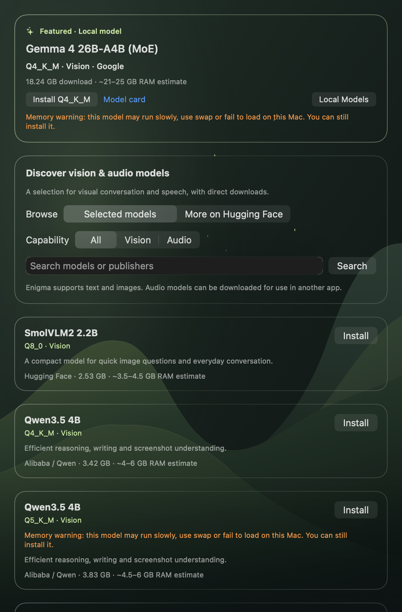
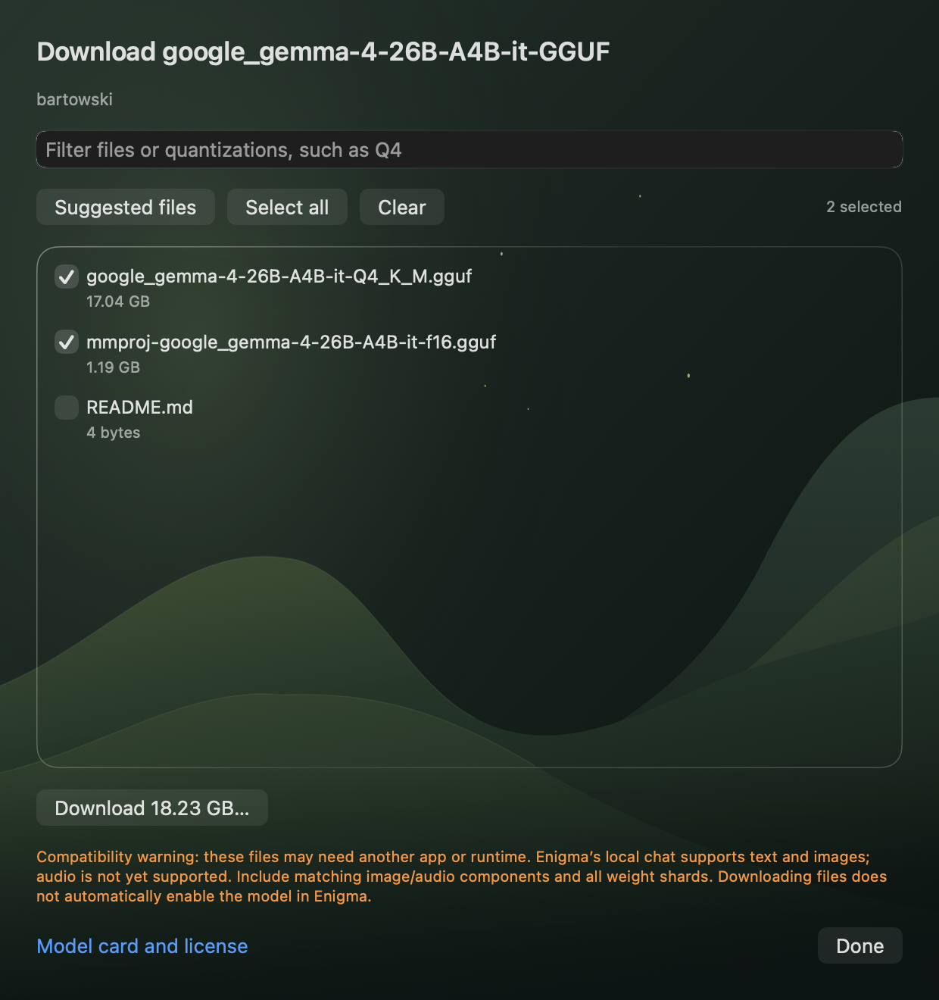

# Discover models

Settings → **Discover** starts with 13 selected vision and vision/audio packages
across every memory tier. **All**, **Vision** and **Audio** narrow the selection;
search matches model names, publishers and quantizations. SmolVLM2, Qwen3.5,
Gemma 4, Ministral 3 and MiniCPM-o are included. Existing recommendations still
favor models expected to run responsively on the current Mac.

The featured **Gemma 4 26B-A4B (MoE), Q4_K_M** card stays visible independently of
memory tier and search filters. **Install Q4_K_M**, **Update Q4_K_M** and **Use Model**
use Enigma's verified installer and model library directly. The package pins
Bartowski revision `10f3b41bcf8d3047f4e136e7197ffc2dd1654c9d`, the exact Q4_K_M
weights, the matching F16 image projector and Enigma's existing runtime.
Gemma 26B accepts text and images; it does not accept audio.

Users can install any compatible package above the recommended memory budget.
A warning immediately below the install controls explains that it may run slowly,
use swap or fail to load. Such models remain excluded from automatic recommendations.
After installation, they are not automatically loaded for a benchmark; users can
choose **Check Performance** when ready. Actual disk space, runtime support,
Metal constraints and artifact validation still determine whether an Enigma
installation is possible. Models requiring another runtime, including MiniCPM-o,
offer **Download files** instead.

## More on Hugging Face

**More on Hugging Face** browses public models for image/text chat, image
captioning, visual or document questions, video understanding, audio/text chat,
speech recognition, text-to-speech, audio generation, audio-to-audio and general
multimodal tasks. Search submits model names or publishers; the task menu narrows
the scope. **Load more models** continues each matching task's pages without a
fixed catalog-size cutoff.

The browser uses published task tags, including secondary tags. `any-to-any`
appears in both modality filters and is labelled **Multimodal**, without assuming
every such model accepts both images and audio. Missing or inaccurate publisher
tags can affect results. Repositories are deduplicated and sorted by download
count among the results loaded so far.

## Direct downloads

Every Hub result has **Download files**. Its in-app file chooser loads the
repository's current immutable revision, file sizes and checksums. Users can
filter filenames or quantizations, choose individual files, select all, or restore
suggested files. For GGUF repositories, suggestions select one Q4_K_M family when
available, all of its split weight files, and an image projector, preferring F16.
Other repositories default to a complete snapshot, including configuration and
tokenizer files. Suggestions do not certify that an unfamiliar package will run.

The download button shows the selected size and asks for a destination folder.
Enigma downloads the files itself, shows progress, supports cancellation, and
offers **Show in Finder** when finished. Downloads continue while the chooser is
closed. The compatibility warning sits immediately below the button. Model-card
and license links remain secondary actions.

File downloads do not automatically install a new runtime or add arbitrary
models to Enigma's library. Enigma currently accepts text and images; audio
packages can be downloaded for use in another app. Public files work without a
Hugging Face account. Gated/private repositories require access approval or
sign-in; this feature does not supply an account-token flow.

## Networking and failure behavior

- The selected package list works offline. Hub browsing and opening a file
  chooser fetch public metadata; weights transfer only after an explicit install
  or download action. No chat content or Hugging Face credentials are sent.
- Sessions are ephemeral and do not use saved cookies or credentials. Typing a
  model search alone sends nothing; submission sends it to Hugging Face.
- Hub pages contain up to 20 models per task, with at most four concurrent
  requests and a 2 MB response limit. Opaque pagination links must remain on
  HTTPS `huggingface.co/api/models` and retain the search and filters.
- Partial failures preserve available results. Retry fetches only failed pages.
  Cancellation and generation checks prevent old results replacing a new search.
- Repository metadata is bounded to 8 MB and 10,000 files. File paths, revision
  hashes, sizes and checksums are validated, including path traversal and case
  collisions on macOS. Download URLs use the resolved immutable revision.
- Large LFS files use the existing disk-backed transfer and SHA-256 verification.
  Ordinary Git files use exact size and Git blob SHA-1 verification. Responses
  exceeding the published size fail during transfer.
- A complete verified snapshot is renamed into a fresh folder on the chosen
  volume. Failure or cancellation removes staging files and leaves earlier
  downloads intact. Downloaded code is never executed.

## Verification

Offline tests cover filtering, pagination, duplicate removal, retries, late
responses, the featured Gemma package, memory warnings, retained disk checks,
revision and path validation, quantization/shard selection, checksum and size
failures, cancellation, atomic snapshots and cumulative progress. Native rendering
checks Discover under both system appearances and the file chooser offline.

Local verification passed with `scripts/verify-xcode.sh build`, `test` and
`analyze`: 516 tests, 10 optional skips and no failures. The seven download tests
also passed after the final F16-versus-BF16 suggestion correction.

Live checks verified paginated image-chat, audio-chat and speech-recognition
listings, plus repository metadata and direct README/configuration downloads for
Gemma 26B, MiniCPM-o 4.5 and Whisper Small using the production download code.
The Gemma suggestion resolves the exact Q4_K_M weights and matching F16 projector.
No full model-weight download or real-model inference benchmark was performed.

Sources checked September 11, 2026:
[Hugging Face search](https://huggingface.co/docs/huggingface_hub/en/guides/search),
[download guide](https://huggingface.co/docs/huggingface_hub/en/guides/download),
[task taxonomy](https://huggingface.co/api/tasks),
[Gemma 26B model card](https://huggingface.co/google/gemma-4-26B-A4B-it),
[Q4 package](https://huggingface.co/bartowski/google_gemma-4-26B-A4B-it-GGUF).
