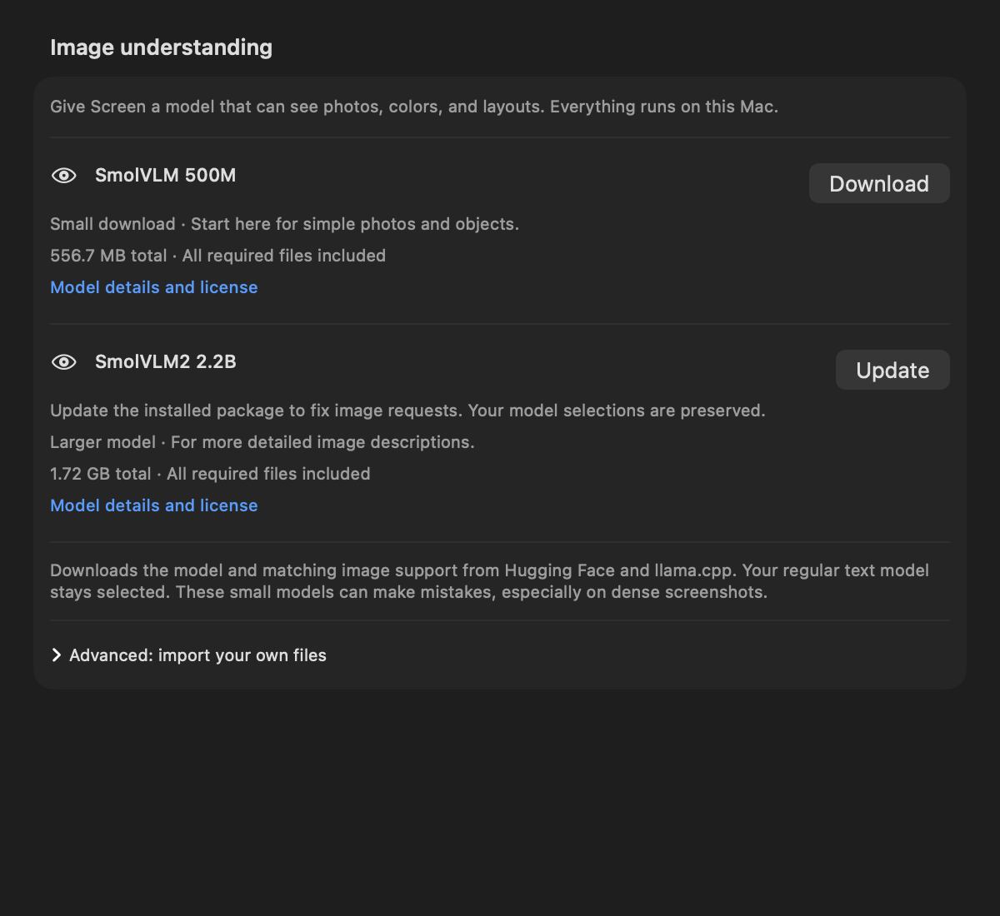

# Screen and Search verification — 2026-09-05

The reported dictionary failure had two reproducible causes. Submission could
finish capture before SwiftUI processed `/search`, leaving the command in the
question and starting generation with Search off. Separately, using SmolVLM 500M
for query planning and answering often produced only a transcription.

## Fixes

- Resolve leading Screen and Search commands together before capture or sending.
  Both orders, mixed case, duplicate commands and immediate Return are covered.
- Let confident short OCR supply dictionary words, memory values and error codes.
  Low-confidence or blank OCR still needs vision. Explicit appearance questions
  still use vision, while confident OCR preserves the lookup spelling.
- After local vision reads the image, use the selected local text-only model for
  query refinement and the answer. No model selection or installation is changed.
- Keep the original question, OCR, relevant observations and retrieved query in
  the final context. Intermediate output never becomes the visible answer.
- Scroll after native view size settles, without SwiftUI geometry or message
  callbacks. Long histories exercise lazy row measurements.
  Context fitting retains room for sources without truncating the user's question.

## Real model and search checks

The installed SmolVLM 500M Q8_0 and selected Qwen2.5 3B Q8_0 were exercised through
the production inference engines. Screenshots were generated in memory, read by
the actual macOS Vision OCR service, and routed through `submitScreen`. Tests used
isolated chat storage. Model files were read from the existing library.

Before the fix, forcing the 500M vision model through all stages produced query
`Yes.` and answer `serenipity` for the dictionary prompt. RAM and HTTP prompts
returned little more than `59.7 MB` and `HTTP 429`. Separate runs also showed
vision confusing `serendipity` with `serenity` and HTTP 429 with HTTP 500 despite
correct OCR. This was a model transcription/planning problem, not an OCR failure.

The corrected pipeline completed all seven cases below with exactly one real
Brave request each, the expected lookup subject and visible Brave source links.
The existing app Keychain credential was used by the stable development-signed
test host; credentials were never printed. Fixed public evidence was also tested
to separate application behavior from changing search results.

| Screen | Prompt | Observed search query |
| --- | --- | --- |
| serendipity | Can you look up what this word means from the dictionary? | serendipity dictionary definition |
| Memory: 59.7 MB | How much RAM am I using, and can you search whether that is a lot? | 59.7 MB RAM usage is lot? |
| serendipity | What color is the word, and can you look up its dictionary definition? | color serendipity dictionary definition |
| ubiquitous | Find a dictionary definition of the word shown here and explain it simply. | ubiquitous dictionary definition simple explanation |
| Memory: 57 MB | Is this a lot of RAM? Please look it up. | 57 MB RAM usage high? |
| HTTP 404 | What does this mean? Search for an explanation. | HTTP 404 error meaning |
| HTTP 429 | Look up what this error means and how to fix it. | HTTP 429 error meaning and fix |

These are pipeline results, not a claim that all seven answers were correct.
Dictionary answers gave definitions, and error answers explained the codes.
The live RAM answers sometimes confused MB with percentages or assumed a total
RAM capacity from unrelated web excerpts. The color question searched correctly
but did not identify the text's color. OCR read the words, numbers and units
correctly. Those remaining answer-quality issues are left for model evaluation
and the owner's model upgrade, as requested. A better model is not guaranteed to
resolve every issue; the opt-in report makes the same cases repeatable.

## Native UI and regression coverage

The prior routing/scroll revision (`da0b3bc`) passed the shared-scheme build and
static analyzer, plus 259 discovered tests with zero failures (258 passed; the
opt-in model matrix was skipped after its separate real runs). All 12 native
panel tests passed, with the animated long-history regression also repeated
three times.

For the compatibility/download repair below, the shared-scheme build and static
analyzer passed, and all 18 focused `LocalVisionTests` passed. The latest full
local run discovered 265 tests: 263 passed, one optional model matrix skipped,
and one failure in the unchanged
`CodexSubscriptionTests.testAppServerEOFAndTimeoutDoNotLeaveRequestsHanging`.
That test received `timedOut` instead of `disconnected` after its fake subprocess
exited; it also failed in isolation. An isolated executable using the same
production server code observed EOF and passed, so the hosted-test discrepancy
remains unresolved. No assertion was changed to hide it. Build products and
reports remain outside the repository; the pull request records GitHub CI.

## SmolVLM 2.2B compatibility repair

The owner's shapes request reproduced a model/runtime compatibility failure.
The original SmolVLM-Instruct Q4_K_M package started successfully with the pinned
b10797 server, then rejected the image request with HTTP 400, `Invalid token`.
The reported CFNetwork `-1004` lines came from `/v1/models` readiness checks
before the localhost listener was ready; they were not the final inference error.
The same request with the installed 500M package succeeded.

This matches the upstream [missing image-token report](https://github.com/ggml-org/llama.cpp/issues/27190).
The catalog now pins the official **SmolVLM2-2.2B-Instruct** Q4_K_M model and its
matching Q8_0 projector at revision `1bc3c9f74ceafd4c8d4411cc9cf188bba3798f91`.
Both downloaded files were verified against publisher byte counts and SHA-256
hashes before testing. The official b10797 runtime remains pinned.

Existing 2.2B installations offer **Update**. Package revision metadata preserves
the installed ID and both model selections. Replacement remains atomic, and
failed or cancelled installation retains the old library. Image requests on the
older package show the update location and keep the draft. OCR/text requests
still work before updating. The 500M package and advanced imports remain usable.
Readiness uses a nonblocking loopback probe with a bounded wait before HTTP,
avoiding normal startup connection-refused logs and TCP retry stalls.

Physical installer testing also found that the async URLSession download helper
did not deliver progress callbacks: a live transfer remained at 0% despite
receiving data. A separate native public-file probe confirmed zero callbacks for
the convenience API and 36 for a delegate-backed 1 MB transfer. The downloader
now uses the latter, with tests that pause the server halfway through to verify
live progress, cancellation, and early rejection of oversized bodies.

### Real replacement-model results

The direct native shapes request returned HTTP 200 and correctly described a
red circle and blue square. Three further requests through the production Swift
vision engine all completed without runtime errors:

| Prompt | Observed result |
| --- | --- |
| Describe the shapes and colors in this image in one sentence. | Correct red circle on the left and blue square on the right. |
| What colors and shapes are shown? | Correctly described both shapes and colors. |
| Identify both objects from left to right. | Returned only `red circle`; the semantic checks for blue/square failed. |

The seven-case Screen/Search matrix was rerun with real OCR, SmolVLM2 2.2B for
vision, Qwen 2.5 3B for text, and fixed public search evidence in isolated metadata.
All seven completed reading/query/search/answer stages, each with one search
request containing the intended subject and rendered source links. The visual
color-and-dictionary case now identified the black text and reached search.
Its answer reused an unsupported definition from the vision notes rather than
the supplied dictionary excerpt, so its existing answer-quality assertion failed.
The optional model tests are therefore **not reported as entirely passing**.
No semantic assertion was removed or weakened. These remaining model-quality
limitations are distinct from the repaired runtime failure.

An initial matrix attempt used a temporary directory URL without a trailing
slash and could not load its vision profile. Correcting that test configuration
allowed the complete matrix above; the user's library was not changed by the test.

Hosted native panel tests submit through the actual composer, including Return
before the draft-change callback, and verify one search, clean saved questions,
source links, draft clearing and final scroll position after an 80-fragment burst.
The original `onChange(of: Array<ChatMessage>)` warning did not appear in the final
test logs. Unrelated AppKit/Core Animation diagnostics can still appear in hosted
rendering tests; this is not a claim that all framework logging is silent.

In the signed app launched from Xcode, `/search Look up the dictionary definition
of serendipity.` produced a definition, five live source links and an empty focused
composer. The final native scroll implementation was also checked in the signed
app with a live lookup for `ubiquitous`: a definition, two example sentences and
five source links appeared, the scroll bar reached the bottom, the composer cleared
and regained focus, and neither per-frame warning appeared in the fresh Xcode log.
The owner subsequently confirmed that manual Screen + Search capture of
`serendipity` produced a successful dictionary lookup. This verifies the basic
physical OCR capture-to-search path.

The owner's installed 2.2B package was then replaced with the verified SmolVLM2
model/projector through the production atomic installation store. The model ID,
model count, main selection and Screen selection were preserved. The existing
official b10797 runtime was reused with shared ownership recorded. The signed
app showed **SmolVLM2 2.2B — Ready for Screen**.

Physical region selection subsequently succeeded on a public shapes fixture.
The attached region reached the vision model and the app answered
`Shapes and colors are: Circle Square`, then cleared the composer. This verifies
capture-to-inference without the former runtime error, but the answer omitted
the requested colors. A subsequent combined visual/search attempt displayed the
focused-query error and retained the draft and image; that attempt is not a
successful end-to-end search check. The owner requested taking over further
physical testing, and computer control stopped. No unsigned verification app
was launched interactively for capture.

Reproduction instructions and opt-in configuration are in
[Screen setup](Screen-Skill.md#real-screensearch-model-matrix). Remove the optional
configuration after use. Normal CI uses deterministic fixtures and does not
download models or call Brave.
