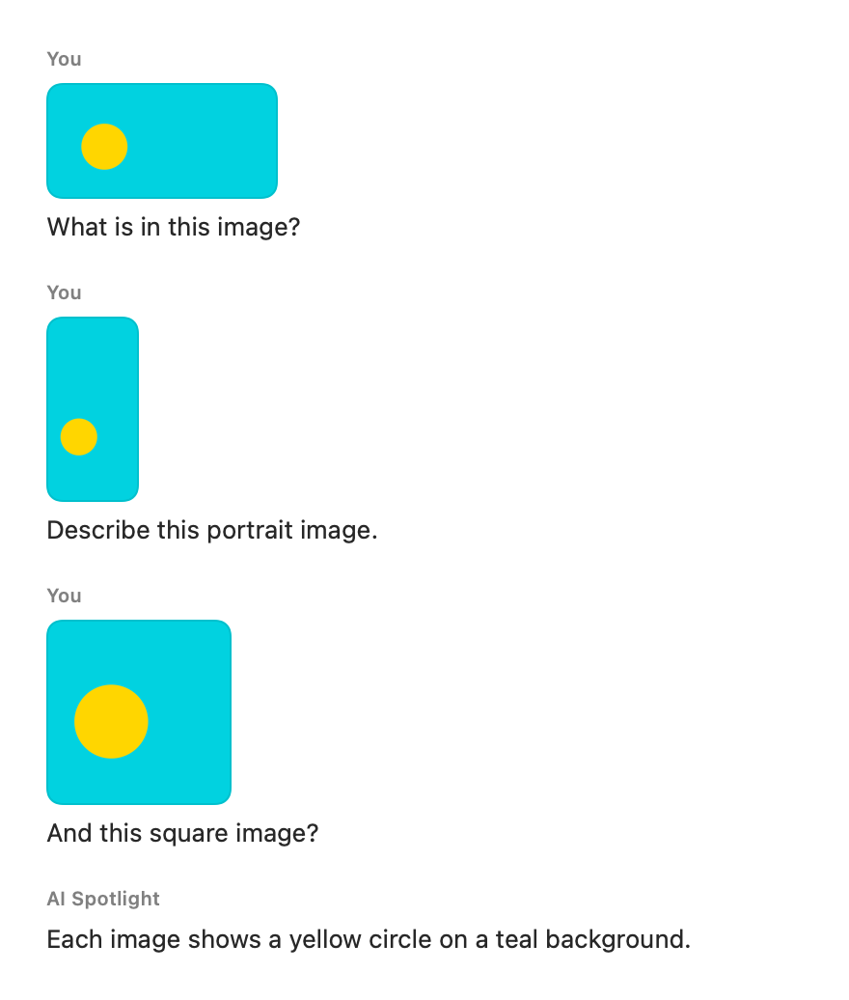
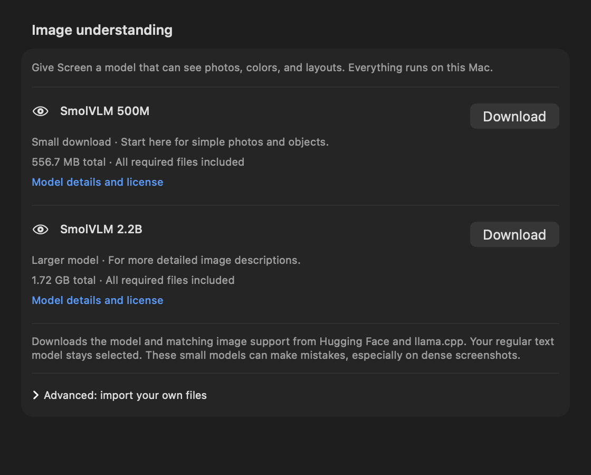

# Screen skill

Screen adds an ephemeral region capture to the current draft. Use **+ → Screen**
for capture-and-compose, or submit **/screen your question** to capture and send
that question automatically. Submitting **/screen** alone captures and waits.
Escape keeps the draft and any previous attachment. Retake replaces an attachment
only after a successful capture. The supplied Adrien Coquet icon is grey when
Screen is off and orange when on, with the same expanding spring transition as
Web Search and support for Reduce Motion.


## Capture and local processing

`ScreenCaptureService` preflights Screen Recording permission and requests it
when absent. Permission preparation happens while the panel is still visible, so
a denial or stale macOS permission entry keeps the draft and shows an inline
explanation without hiding the UI. If permission is granted but preflight still
fails, the app explains that it needs to be restarted. Once authorized, the
coordinator makes the panel fully transparent and click-through while keeping its
SwiftUI compositor surface ordered. It hides other visible AI Spotlight windows,
blocks panel/settings shortcuts from reopening them during selection, waits 200
ms, and invokes `/usr/sbin/screencapture -i -x` with a UUID PNG path. It eagerly decodes the image and deletes the file before returning.
No output file means cancellation. The panel's original frame is restored, so
capture does not move the panel between displays; macOS owns region selection.

`ScreenAttachment` owns the original `NSImage`, pixel dimensions, MIME type,
UUID, source, timestamp, OCR text/confidence, processing status, and routing
decision. It is deliberately not Codable. When the first response text arrives,
the user message retains a small in-memory PNG preview and the composer releases
the submitted screenshot. The preview appears immediately above that message's
text, fits within 120 × 96 points without cropping, and uses up to 240 × 192
pixels for Retina displays. It remains attached when switching chats during the
current app session. `ChatMessage.CodingKeys` excludes the preview from all
serialization: saved history still contains no screenshot pixels, and previews
do not reappear after restarting the app. OCR context is also excluded from
saved history. A preparation, connection, or permission failure before the first
response text retains the draft and attachment.



Apple Vision runs locally, on a background task, against the original pixels.
Recognition is accurate, language correction is off, and automatic language
detection is on. Highest-confidence candidates are grouped into rows and ordered
top-to-bottom/left-to-right, with average confidence retained. OCR is usable at
40 non-whitespace characters and average confidence of at least 0.55.

Only a vision request resizes the image. `ScreenImagePreprocessor` preserves its
aspect ratio, never upscales, caps the longest edge at 1568 pixels, and makes an
in-memory JPEG at 0.85 quality. Base64 is created only by request serialization.

## Routing and privacy

`ScreenRoutingPolicy` is deterministic. Usable OCR normally goes to a text model;
visual intent (charts, diagrams, photos, colors, layout, positions, buttons,
objects, or visual bugs) and inadequate OCR require vision. Explicit requests
to transcribe visible text can still use OCR. The OCR context is clearly labelled
as untrusted screenshot content and separated from the user's instructions.
This is a heuristic policy: ambiguous prompts can be clarified by naming the
visual property that matters.

| Mode | Sufficient OCR | Visual interpretation |
| --- | --- | --- |
| Local | Selected local text model; no image upload | Installed local vision profile, or a useful limitation |
| Cloud | Selected cloud text model; no image upload | Configured cloud vision model with permission; local vision when upload is unavailable |
| Auto | Selected local text model when available, otherwise configured cloud text | Configured cloud vision model with permission; local vision for privacy/offline use |

**Allow screenshots to be sent to cloud models** defaults off. Screen settings
explain that extracted text may go to the text model in Auto/Cloud even while
image uploads are disabled. The first visual request needing cloud permission
shows an explanation with **Allow & Send** and **Keep Screenshots Local**.
Declining preserves the draft and is remembered. The Settings toggle can later
change that decision. Turning upload off also stops an active cloud Screen
request; already transmitted data cannot be recalled.

Permission is checked again after image preparation and at cloud serialization.
Cloud adapters reject image requests marked Local, lacking upload permission,
or targeting a model without explicit vision support. Local transport only accepts
numeric loopback addresses, disables proxies/caching, and refuses redirects.
An offline cloud failure before the first response can fall back to installed
local vision. When Web Search is enabled, Screen first reads relevant facts through
OCR or a dedicated vision generation. On a local vision route, the selected local
text-only model takes over query refinement and the final answer when available;
otherwise the Screen model continues. No model preference or installed library is
changed. For confident short text lookups, OCR supplies the query subject even if
vision misreads the spelling; other queries retain the visual observations and
OCR. Query examples preserve dictionary, memory, and error-resolution intent. Local
text query generation uses temperature 0 and grounded Screen answers use 0.2.
High-confidence OCR (at least 0.85) can serve short text lookup questions without
the general 40-character threshold. Explicit visual questions still require vision;
blank and low-confidence short OCR retain the vision fallback. Brave searches
that refined query before the final answer uses the original question, screenshot
context, observations, and retrieved evidence. A vague "Is this a lot of RAM?"
can therefore search for the actual memory value read from the screen.

Relevant screen details can enter the query. Raw image bytes, full OCR payloads,
and history are not attached to Brave. Query instructions limit output to relevant
details and exclude credentials/personal data, but model relevance and redaction
are not guaranteed. The composer explains that queries may include screen details.
Planning and search failures preserve the draft and attachment. Stop cancels every
stage. Cloud upload permission is rechecked between stages; offline fallback
reuses any completed query and evidence. Source links are retained with the reply;
intermediate readings, queries, OCR, and excerpts are not saved as chat turns.

The conversation observes native view size changes and waits for measurements
to settle before scrolling, with top alignment for short replies and a new scroll
identity when switching chats. Pending scroll work is replaced when another size
arrives. It does not publish SwiftUI state from geometry callbacks or observe
message arrays. This avoids using a stale layout height and removes the callback behind the
`onChange(of: Array<ChatMessage>)` warning.

Leading `/screen` and `/search` commands are parsed together at submission in
either order, even if SwiftUI has not delivered the draft's change callback yet.
Duplicate commands activate each tool once. Command-only capture, cancellation,
and literal commands inside the question retain their existing behavior.

## Models and adapters

Every cloud/local model exposes text and vision capabilities, provider, location,
and optional projector path. Reviewed cloud vision IDs are enumerated exactly;
unknown or manually entered names do not gain vision support from their spelling.
Existing local libraries decode as text-only. The current ChatGPT/Codex
subscription adapter remains text-only and can handle OCR context; configure an
OpenAI, Anthropic, or Gemini API vision profile for cloud image interpretation.
The vision profile can differ from the normal cloud text model.

`PreparedScreenImage` carries neutral image bytes into the provider boundary.
`MessageContentPart` represents text or an image with MIME type and raw base64.
The same serializer translates those parts into:

- OpenAI-compatible chat: `text` and `image_url` blocks with a data URI.
- OpenAI Responses (the existing OpenAI adapter): `input_text`/`input_image`.
- Anthropic: base64 image source with `media_type` and `data`.
- Gemini: text parts and `inlineData`; discovery, credentials, and streaming are
  connected to the existing Cloud settings.
- Native Ollama `/api/chat`: raw base64 values in the user message's `images`.
  The native local adapter is available independently; the app's imported local
  vision profiles use llama-server.

The capture/OCR components do not know provider schemas. The provider layer does
not know how an image was captured. New feature files live under
`AI-Spotlight/Screen/`, following the existing Swift/Xcode project layout rather
than the original scaffold's suggested `src/` convention.

## Guided local image-model downloads

In **Settings → Local Models → Image understanding**, click **Download** next
to a model. The app downloads the model, its matching image projector, and an
architecture-specific official llama.cpp runtime together. No file picker,
terminal command, or separate executable download is needed for these choices:

| Model | Package size on Apple silicon | Intended use |
| --- | --- | --- |
| SmolVLM 500M Q8_0 | 556.7 MB | Small starter for simple photos and objects |
| SmolVLM 2.2B Q4_K_M | 1.72 GB | Larger option for image descriptions |

Both models use their matching Q8_0 projector. Sizes include the runtime. These
are small models, and answers on dense screenshots may be unreliable.

The section shows combined progress and **Cancel**, then **Ready for Screen**
after successful installation. **Use for Screen** switches between installed
image models without replacing the selected text model. This choice persists
under `screen.localVisionModelID`; missing choices fall back to another installed
vision profile. Installing a model does not enable cloud screenshot uploads.



The built-in packages pin model/projector revisions and SHA-256 checksums from
[the publisher's 500M repository](https://huggingface.co/ggml-org/SmolVLM-500M-Instruct-GGUF/tree/72e986006ef53e37cdd3f6d4241c90b0f01df376) and
[2.2B repository](https://huggingface.co/ggml-org/SmolVLM-Instruct-GGUF/tree/e75618fdae83145c487f1b4d8115bb02a5b58ecc).
The runtime pins the official [llama.cpp b10797 release](https://github.com/ggml-org/llama.cpp/releases/tag/b10797),
including separate arm64/x64 archive sizes and publisher SHA-256 digests.

Text and vision downloads share a file-based URLSession transfer with progress,
size bounds, and SHA-256 verification. Memory and disk checks run before a vision
download, and disk space is checked again before installation. The verified
runtime is unpacked in a private staging directory; archive paths and resolved
links are checked, and `llama-server --help` must successfully advertise image
and offline support before the runtime is retained.

The full runtime directory, including dynamic libraries, is kept permanently in
the model library. Model/projector metadata uses the existing atomic installer.
Cancellation and failed downloads remove staging files; failed installation also
removes its new runtime. Replacing a downloaded profile retires its prior runtime
only when it is app-owned and no other profile references it. Manually imported
executables are never removed.

### Advanced manual import

Expand **Advanced: import your own files** to select a vision model GGUF, its
matching mmproj GGUF, and a recent `llama-server` executable with multimodal and
`--offline` support. Keep a manually selected executable and its accompanying
libraries in a permanent folder. The model and projector are copied into the
library, and llama-server validates their actual compatibility when loading.

The vision engine unloads the embedded text model before starting its separate
server. It uses `-m <model> --mmproj <projector>`, loopback binding, a fresh port,
a per-request credential/alias, one slot, `--offline`, and no web UI. It verifies
the server's model alias before sending image bytes. The server is terminated on
completion, failure, or cancellation. The bundled text-only llama.cpp b5046
bridge remains unchanged; image-model downloads are optional.

## Stable development signing

macOS associates Screen Recording consent with the app's signed code identity,
not just its displayed name or bundle identifier. An ad-hoc build has a
hash-based identity that changes whenever the executable changes. System
Settings can therefore show an enabled `PrimaryAgent` entry while a newly built
copy still fails `CGPreflightScreenCaptureAccess()`.

Use two separate build paths during development:

- For interactive Screen testing, run the app from Xcode with **Automatically
  manage signing** enabled, a development team selected, and **Apple
  Development** as the signing certificate. Keep
  `com.leow427.AISpotlight` as the bundle identifier.
- For build, test, and analyzer verification, use the commands in `AGENTS.md`.
  They disable signing and place their products in
  `/tmp/AI-Spotlight-Verification`. They also disable Launch Services
  registration and unregister the temporary host after app-hosted tests, so it
  cannot replace or compete with the signed app that macOS authorized. Do not
  launch the app from that verification directory.

If Xcode has no development identity, open **Xcode → Settings → Accounts**, sign
in with an Apple Account, select its team, choose **Manage Certificates**, and
create an **Apple Development** certificate. Then select that team in the app
target's **Signing & Capabilities** pane.

After changing from ad-hoc to Apple Development signing, perform this recovery
once:

1. Quit every running copy of PrimaryAgent.
2. Run `tccutil reset ScreenCapture com.leow427.AISpotlight` in Terminal.
3. Build and run the signed app from Xcode.
4. Use Screen, allow **Screen & System Audio Recording**, and restart the app
   when macOS asks.

Later signed rebuilds with the same team and bundle identifier retain consent.
If a build needs permission again, inspect the launched app with
`codesign -d -r- /path/to/PrimaryAgent.app`. A designated requirement consisting
only of `cdhash` identifies another ad-hoc build.

## Verification

The combined Screen/Search regression covers Local, Cloud, and Auto with OCR and
vision, text-only requests through a selected vision model, search-off behavior,
failed retrieval, image context budgets, cancellation/replacement, permission
revocation during search, and reuse of evidence on offline cloud fallback. The
native composer test enables both tools and streams 80 rapid fragments, checks
that all text arrives, and waits for the final text to become visible. The full
250-test suite, shared-scheme build, and static analyzer passed on 2026-09-05;
the run contained no multiple-updates-per-frame warning. These combined requests
use deterministic search and model responses, so they verify orchestration and
UI behavior rather than the quality of a live SmolVLM 500M answer. Query-refinement
regressions additionally verify the ordered vision → query → search → answer
handoff with an empty OCR result, a vague RAM question, and a 57 MB reading;
invalid/oversized planning output; cancellation during both planning stages;
and permission revocation before refinement. Screen-plus-search requires one
extra model call for OCR routes and two for vision routes. Later real-model
verification and the follow-up command/scroll fixes are documented in
[Screen search verification](Screen-Search-Verification.md).

Development proceeded sequentially, with a successful build before each phase's
targeted tests: capture/panel (16 tests), OCR/preprocessing (11), routing/privacy
(31), provider/context/streaming (35), local vision/installation (32), and connected
Screen/request lifecycle (35). Counts overlap because regressions are rerun.
The installation suite caught and verified a fix for destination ownership during
rollback. Native preview inspection caught an SVG wrapper that rendered blank;
the asset now retains the supplied drawing paths in a supported SVG wrapper,
and the test checks nontransparent pixels as well as slot layout.

A real production smoke test on this Mac used official llama.cpp **b10797** and
`ggml-org/SmolVLM-256M-Instruct-GGUF` Q8_0 model/projector files at revision
`b9e4379657e1450d04d02eec8e345667265b0a00`. Download sizes and SHA-256 values were
verified against publisher metadata. The test imported into a temporary library,
loaded both files through `LlamaServerVisionEngine`, sent a synthetic colored-shape
JPEG, and received model output. This verifies native loading and multimodal
request transport, not answer quality: the tiny smoke model returned only `1`.
No user screenshot, API key, or installed model library was used for this test.

To opt into the native smoke test, create `/tmp/AI-Spotlight-Vision-Smoke.json`
with file URLs to your local test assets:

```json
{
  "model": "file:///absolute/path/model.gguf",
  "projector": "file:///absolute/path/mmproj.gguf",
  "server": "file:///absolute/path/llama-server"
}
```

Run the shared scheme with
`-only-testing:'AI SpotlightTests/ScreenNativeSmokeTests'`. Without this explicit
fixture the optional native smoke test is reported skipped; ordinary CI never
downloads a model. The normal deterministic tests cover both image protocols and
local vision routing without external services.

### Real Screen/Search model matrix

`ScreenSearchNativeSmokeTests` is opt-in and reads existing model files without
installing, selecting, or downloading anything. It renders synthetic fixtures
(dictionary words, RAM readings, and HTTP errors), runs production OCR, vision,
query generation and answering, and checks query subjects, basic answer content
and rendered Brave sources. These assertions do not establish complete factual
accuracy; review the generated report too. An additional color-and-dictionary question exercises vision handoff;
its visual answer quality remains dependent on the chosen vision model.
Create `/tmp/AI-Spotlight-Screen-Search-Smoke.json`:

```json
{
  "modelsDirectory": "file:///absolute/path/to/Models/",
  "visionModelID": "installed-vision-model-id",
  "useTextModel": true,
  "liveSearch": false
}
```

Run `-only-testing:'AI SpotlightTests/ScreenSearchNativeSmokeTests'`. The selected
text model in that library handles the text stages. `useTextModel: false` compares
the old behavior of using vision for every stage. Fixed evidence is the default;
`liveSearch: true` explicitly uses the production Brave client and existing app
Keychain credential, incurring normal Brave usage. Run live checks with the stable
Apple Development-signed Xcode host so Keychain access matches the app identity.
The report at `/tmp/AI-Spotlight-Screen-Search-Smoke-Result.txt` contains only
synthetic inputs, model outputs, public queries and URLs, never credentials.
Remove the opt-in config after testing so routine CI remains deterministic.

### Interactive checks still required

Automated capture tests inject the permission/process boundaries; they do not
claim to drag a real system selection. On the user's unlocked Mac, verify:

- **+ → Screen** on source code, terminal output, and compiler errors: thumbnail,
  focus, no automatic send; submit and check **Local OCR · Image not sent**.
- **/screen what is the answer to this piece of code?**: drag a region and check
  one automatic submission; **/screen** alone must wait.
- Escape, retake cancellation, draft preservation, and a secondary display.
- Denied Screen Recording permission and a newly granted permission that requires
  restarting the app, using the Apple Development-signed application identity.
- Charts, diagrams, photos, and little/no readable text in Local with and without
  an installed vision model.
- Auto/Cloud with upload disabled, declining the first explanation, then explicitly
  enabling upload with a configured provider and confirming a real response.

Standalone launch verification exposed a missing framework runpath: the llama
framework was embedded, but the app could only find it through Xcode's test
environment. Debug and Release now search the bundle's Frameworks directory.
`AppBundleTests` checks the actual binary load commands and resolves the dependency
inside the app bundle. The Release app was verified launching outside Xcode.

Investigation of an open-but-blank panel on Screen submission found synchronous
secret reads in credential-availability checks. A sampled local test process was
blocked in `SecItemCopyMatching` on the main thread, waiting for Keychain access.
Screen routing called the same credential-read path for cloud availability,
even when local OCR could answer. Availability checks now request only Keychain
attributes with authentication interaction disallowed. Actual API-key retrieval
remains in the provider request path. Search settings use the same metadata check
so constructing the composer cannot ask to decrypt its search key.

Regression tests assert that availability checks never read secrets, inspect the
noninteractive Keychain query, and render the complete native panel at 752×462 in
Auto mode through attachment, loading, first response, and completion. Apple
Vision verifies that the prompt, progress/Stop controls, and reply remain visible
in the rendered output. These tests use synthetic images, isolated chat storage,
and a controlled local stream.

The credential regressions failed before the fix. All 60 targeted tests and the
full 217-test suite pass locally afterward, including the optional native vision
fixture. An initial full run hit an existing Codex app-server EOF/timeout timing
failure; the unchanged test passed in isolation and the unchanged full suite then
passed. No test or assertion was removed or weakened. The PR records build,
analysis, and CI results for the final revision.

Subsequent signed-app verification with Computer Use completed seven OCR
submissions across three chats through both entry points. The measured panel
layout regression and condition matrix are recorded in
[Screen-Panel-Regression.md](Screen-Panel-Regression.md). No live cloud screenshot
upload has been performed.

### Guided-download verification (2026-09-05)

The guided download adds seven deterministic tests covering pinned matching
packages, all-part installation, existing text selection, replacement cleanup,
checksum/size/HTTP/runtime/metadata/disk failures, cancellation, persisted image
selection, duplicate clicks, and the rendered download UI. The 60-test related
suite and full 229-test suite pass. Build and static analysis also pass. The
existing Codex EOF/timeout test initially failed; the unchanged assertions passed
with temporary tracing and in the clean full-suite rerun. No connection code or
test was changed.

The signed Xcode app exposes both download choices through accessibility. A real
500M download was started, cancelled, and restarted. That check caught a
URLSession cancellation error being displayed as a failure; cancellation now
returns to the ready state after cleanup, with a regression for that error type.
The real package download is still in progress on the user's slow connection.
Completed installation and an image response using this new package remain
pending; the app is being left running for that check. The rendered preview
above comes from the production SwiftUI view in the regression test.

## Primary references

- [Apple DTS: ad-hoc signing makes every ScreenCaptureKit build a new app](https://developer.apple.com/forums/thread/819406)
- [Create and manage an Apple Development signing identity in Xcode](https://developer.apple.com/documentation/xcode/sharing-your-teams-signing-certificates)
- [Apple Vision text recognition](https://developer.apple.com/documentation/vision/vnrecognizetextrequest)
- [OpenAI image inputs](https://developers.openai.com/api/docs/guides/images-vision)
- [Anthropic vision inputs](https://platform.claude.com/docs/en/build-with-claude/vision)
- [Gemini image understanding](https://ai.google.dev/gemini-api/docs/image-understanding)
- [Ollama native chat](https://docs.ollama.com/api/chat)
- [llama.cpp server flags and multimodal input](https://github.com/ggml-org/llama.cpp/blob/master/tools/server/README.md)
- [Smoke-test model and matching projector](https://huggingface.co/ggml-org/SmolVLM-256M-Instruct-GGUF/tree/b9e4379657e1450d04d02eec8e345667265b0a00)


## Hide inactive composer tools

Use **⌘⇧H** (or **+ → Hide Inactive Tools**) to reclaim text space after turning
Screen or Web Search off. Active tools stay visible, draft text and attachments
are retained, and the shortcut does nothing during capture, OCR, or generation.
The plus menu uses compact 16-point icons. The shortcut is listed in Help and in
the inactive tools' hover hints.
