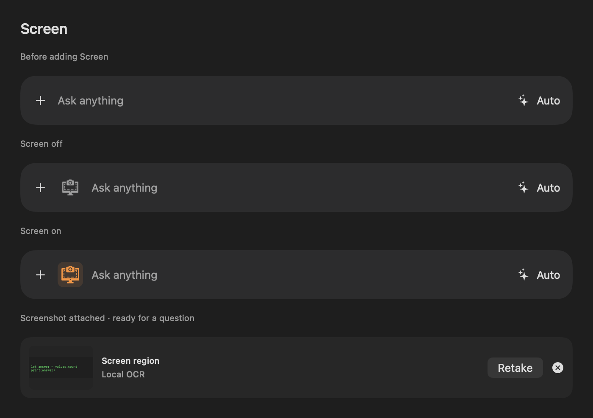

# Screen skill

Screen adds an ephemeral region capture to the current draft. Use **+ → Screen**
for capture-and-compose, or submit **/screen your question** to capture and send
that question automatically. Submitting **/screen** alone captures and waits.
Escape keeps the draft and any previous attachment. Retake replaces an attachment
only after a successful capture. The supplied Adrien Coquet icon is grey when
Screen is off and orange when on, with the same expanding spring transition as
Web Search and support for Reduce Motion.



## Capture and local processing

`ScreenCaptureService` preflights Screen Recording permission and requests it
when absent. If permission is granted but preflight still fails, the app explains
that it needs to be restarted. The coordinator hides the panel and other visible
AI Spotlight windows, blocks panel/settings shortcuts from reopening them during
selection, waits 200 ms, and invokes `/usr/sbin/screencapture -i -x` with a UUID
PNG path. It eagerly decodes the image and deletes the file before returning.
No output file means cancellation. The panel's original frame is restored, so
capture does not move the panel between displays; macOS owns region selection.

`ScreenAttachment` owns the original `NSImage`, pixel dimensions, MIME type,
UUID, source, timestamp, OCR text/confidence, processing status, and routing
decision. It is deliberately not Codable. The existing chat/session types never
contain image bytes. OCR context is used for the request and is also excluded
from saved history. A submitted screenshot is released from the composer when
the first response text arrives; a preparation, connection, or permission failure
before that point retains the draft and attachment.

Apple Vision runs locally, on a background task, against the original pixels.
Recognition is accurate, language correction is off, and automatic language
detection is on. Highest-confidence candidates are grouped into rows and ordered
top-to-bottom/left-to-right, with average confidence retained. OCR is usable at
40 non-whitespace characters and average confidence of at least 0.55.

Only a vision request resizes the image. `ScreenImagePreprocessor` preserves its
aspect ratio, never upscales, caps the longest edge at 1568 pixels, and makes an
in-memory JPEG at 0.85 quality. Base64 is created only by request serialization.

## Routing and privacy

`ScreenRoutingPolicy` is deterministic. Usable OCR normally goes to a text model;
visual intent (charts, diagrams, photos, colors, layout, positions, buttons,
objects, or visual bugs) and inadequate OCR require vision. Explicit requests
to transcribe visible text can still use OCR. The OCR context is clearly labelled
as untrusted screenshot content and separated from the user's instructions.
This is a heuristic policy: ambiguous prompts can be clarified by naming the
visual property that matters.

| Mode | Sufficient OCR | Visual interpretation |
| --- | --- | --- |
| Local | Selected local text model; no image or search request | Installed local vision profile, or a useful limitation |
| Cloud | Selected cloud text model; no image upload | Configured cloud vision model with permission; local vision when upload is unavailable |
| Auto | Selected local text model when available, otherwise configured cloud text | Configured cloud vision model with permission; local vision for privacy/offline use |

**Allow screenshots to be sent to cloud models** defaults off. Screen settings
explain that extracted text may go to the text model in Auto/Cloud even while
image uploads are disabled. The first visual request needing cloud permission
shows an explanation with **Allow & Send** and **Keep Screenshots Local**.
Declining preserves the draft and is remembered. The Settings toggle can later
change that decision. Turning upload off also stops an active cloud Screen
request; already transmitted data cannot be recalled.

Permission is checked again after image preparation and at cloud serialization.
Cloud adapters reject image requests marked Local, lacking upload permission,
or targeting a model without explicit vision support. Local transport only accepts
numeric loopback addresses, disables proxies/caching, and refuses redirects.
An offline cloud failure before the first response can fall back to installed
local vision. Web Search is visibly paused while an enabled Screen attachment
is being submitted; OCR is never accidentally sent to Brave.

## Models and adapters

Every cloud/local model exposes text and vision capabilities, provider, location,
and optional projector path. Reviewed cloud vision IDs are enumerated exactly;
unknown or manually entered names do not gain vision support from their spelling.
Existing local libraries decode as text-only. The current ChatGPT/Codex
subscription adapter remains text-only and can handle OCR context; configure an
OpenAI, Anthropic, or Gemini API vision profile for cloud image interpretation.
The vision profile can differ from the normal cloud text model.

`PreparedScreenImage` carries neutral image bytes into the provider boundary.
`MessageContentPart` represents text or an image with MIME type and raw base64.
The same serializer translates those parts into:

- OpenAI-compatible chat: `text` and `image_url` blocks with a data URI.
- OpenAI Responses (the existing OpenAI adapter): `input_text`/`input_image`.
- Anthropic: base64 image source with `media_type` and `data`.
- Gemini: text parts and `inlineData`; discovery, credentials, and streaming are
  connected to the existing Cloud settings.
- Native Ollama `/api/chat`: raw base64 values in the user message's `images`.
  The native local adapter is available independently; the app's imported local
  vision profiles use llama-server.

The capture/OCR components do not know provider schemas. The provider layer does
not know how an image was captured. New feature files live under
`AI-Spotlight/Screen/`, following the existing Swift/Xcode project layout rather
than the original scaffold's suggested `src/` convention.

## Optional local llama.cpp vision

In **Advanced Settings → Local Models → Local Vision**, select:

1. A vision model GGUF.
2. Its matching mmproj GGUF from the same model release.
3. A current `llama-server` executable with multimodal and `--offline` support.

Import copies the GGUF and projector together into the model library and commits
their metadata atomically. Failed copies/moves/metadata writes roll back only
files created by that transaction. The normal text-model selection is preserved.
The app checks GGUF headers, separate files, projector availability, executable
availability, and a bounded context setting. llama-server validates the actual
model/projector compatibility when loading. Imports are user-selected profiles,
not new automatic catalog recommendations.

The vision engine unloads the embedded text model before starting the separate
server. It uses `-m <model> --mmproj <projector>`, loopback binding, a fresh port,
a per-request credential/alias, one slot, `--offline`, and no web UI. It verifies
the server's model alias before sending image bytes. The server is terminated on
completion, failure, or cancellation. The embedded text-only llama.cpp b5046
bridge remains unchanged; no native dependency upgrade or mandatory vision-model
download is introduced.

## Verification

Development proceeded sequentially, with a successful build before each phase's
targeted tests: capture/panel (16 tests), OCR/preprocessing (11), routing/privacy
(31), provider/context/streaming (35), local vision/installation (32), and connected
Screen/request lifecycle (35). Counts overlap because regressions are rerun.
The installation suite caught and verified a fix for destination ownership during
rollback. Native preview inspection caught an SVG wrapper that rendered blank;
the asset now retains the supplied drawing paths in a supported SVG wrapper,
and the test checks nontransparent pixels as well as slot layout.

A real production smoke test on this Mac used official llama.cpp **b10797** and
`ggml-org/SmolVLM-256M-Instruct-GGUF` Q8_0 model/projector files at revision
`b9e4379657e1450d04d02eec8e345667265b0a00`. Download sizes and SHA-256 values were
verified against publisher metadata. The test imported into a temporary library,
loaded both files through `LlamaServerVisionEngine`, sent a synthetic colored-shape
JPEG, and received model output. This verifies native loading and multimodal
request transport, not answer quality: the tiny smoke model returned only `1`.
No user screenshot, API key, or installed model library was used for this test.

To opt into the native smoke test, create `/tmp/AI-Spotlight-Vision-Smoke.json`
with file URLs to your local test assets:

```json
{
  "model": "file:///absolute/path/model.gguf",
  "projector": "file:///absolute/path/mmproj.gguf",
  "server": "file:///absolute/path/llama-server"
}
```

Run the shared scheme with
`-only-testing:'AI SpotlightTests/ScreenNativeSmokeTests'`. Without this explicit
fixture the optional native smoke test is reported skipped; ordinary CI never
downloads a model. The normal deterministic tests cover both image protocols and
local vision routing without external services.

### Interactive checks still required

Automated capture tests inject the permission/process boundaries; they do not
claim to drag a real system selection. On the user's unlocked Mac, verify:

- **+ → Screen** on source code, terminal output, and compiler errors: thumbnail,
  focus, no automatic send; submit and check **Local OCR · Image not sent**.
- **/screen what is the answer to this piece of code?**: drag a region and check
  one automatic submission; **/screen** alone must wait.
- Escape, retake cancellation, draft preservation, and a secondary display.
- Denied Screen Recording permission and a newly granted permission that requires
  restarting the app, using the actual signed application identity.
- Charts, diagrams, photos, and little/no readable text in Local with and without
  an installed vision model.
- Auto/Cloud with upload disabled, declining the first explanation, then explicitly
  enabling upload with a configured provider and confirming a real response.

Standalone launch verification exposed a missing framework runpath: the llama
framework was embedded, but the app could only find it through Xcode's test
environment. Debug and Release now search the bundle's Frameworks directory.
`AppBundleTests` checks the actual binary load commands and resolves the dependency
inside the app bundle. The Release app was verified launching outside Xcode.

Investigation of an open-but-blank panel on Screen submission found synchronous
secret reads in credential-availability checks. A sampled local test process was
blocked in `SecItemCopyMatching` on the main thread, waiting for Keychain access.
Screen routing called the same credential-read path for cloud availability,
even when local OCR could answer. Availability checks now request only Keychain
attributes with authentication interaction disallowed. Actual API-key retrieval
remains in the provider request path. Search settings use the same metadata check
so constructing the composer cannot ask to decrypt its search key.

Regression tests assert that availability checks never read secrets, inspect the
noninteractive Keychain query, and render the complete native panel at 752×462 in
Auto mode through attachment, loading, first response, and completion. Apple
Vision verifies that the prompt, progress/Stop controls, and reply remain visible
in the rendered output. These tests use synthetic images, isolated chat storage,
and a controlled local stream.

The credential regressions failed before the fix. All 60 targeted tests and the
full 217-test suite pass locally afterward, including the optional native vision
fixture. An initial full run hit an existing Codex app-server EOF/timeout timing
failure; the unchanged test passed in isolation and the unchanged full suite then
passed. No test or assertion was removed or weakened. The PR records build,
analysis, and CI results for the final revision.

The exact user-operated Auto screenshot flow still needs confirmation with the
updated app. No live cloud screenshot upload has been performed. Native mouse
control is unavailable in this assistant session; real selection and system
consent checks above require the user.

## Primary references

- [Apple Vision text recognition](https://developer.apple.com/documentation/vision/vnrecognizetextrequest)
- [OpenAI image inputs](https://developers.openai.com/api/docs/guides/images-vision)
- [Anthropic vision inputs](https://platform.claude.com/docs/en/build-with-claude/vision)
- [Gemini image understanding](https://ai.google.dev/gemini-api/docs/image-understanding)
- [Ollama native chat](https://docs.ollama.com/api/chat)
- [llama.cpp server flags and multimodal input](https://github.com/ggml-org/llama.cpp/blob/master/tools/server/README.md)
- [Smoke-test model and matching projector](https://huggingface.co/ggml-org/SmolVLM-256M-Instruct-GGUF/tree/b9e4379657e1450d04d02eec8e345667265b0a00)
