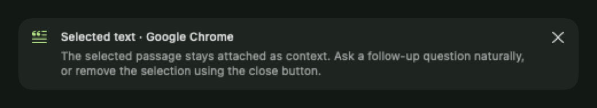

# Selection Context

Highlight text in another app and tap **Option twice** to start a new temporary
Enigma chat close to the pointer. **Shift–Option–Space** is the conventional backup.
Option–Space still toggles the existing panel. Help contains all shortcuts,
an Accessibility status and Settings button, a choice of Option/Command/Shift for the
solo double tap, an enable switch, and Fast/Normal/Relaxed timing.

When Accessibility is missing, the composer asks to enable Selection Context and
provides **Open Accessibility Settings…**. This requests system trust and opens the
Accessibility page directly even if macOS suppresses a repeated popup. Enable
**AI Spotlight** (the current macOS display name for Enigma). Permission status and shortcut
monitors refresh when switching apps, so granting access does not require a restart.

The source is captured before the panel becomes key. The small “Selected text ·
App” card stays above the composer across follow-ups. Removing it revokes the
replacement capability and excludes the attachment from subsequent requests.
Earlier answers may naturally mention material already discussed. Questions remain
ordinary conversation messages; there are no rewrite/explain/verify workflows.

## Architecture and privacy

- `ConversationContext` is a provider-neutral, session-only attachment with identity,
  kind, source attribution and a text representation. Screenshot, file, webpage and
  image kinds leave room for future payloads without changing conversation routing.
  Existing screenshot/file flows can coexist with selected text.
- `ChatContextPreparer` expands attachments in request copies before token counting.
  JSON-encoded source material is explicitly described as untrusted context, never
  instructions. Drafts and displayed messages remain unchanged. Local, cloud,
  multimodal, Auto, and File Mode paths receive the same text representation.
- Web Search uses the selected model to derive a bounded query from the question
  and attachment, then follows the existing evidence preparation path. Relevant
  selection details can reach Brave when search is enabled (including existing
  automatic-search preferences); the composer explains this. Capture itself makes
  no network request. Local mode never uses a cloud model to derive a query.
- One temporary session lives in memory. It does not write the chat archive or count
  against the five saved conversations. It is discarded on a new invocation or on
  switching to another chat. Hiding/reopening the panel retains it until then or
  app exit. Invoking a new chat stops an in-progress response using the existing
  request-cancellation protections; saved message contents remain intact.
- The shortcut observes event metadata only. Accessibility text reads happen only
  during deliberate capture or explicit replacement. Secure Event Input, secure
  roles/subroles and protected ancestors block both Accessibility and copy fallback.
  Unknown/inaccessible focus or ancestry fails closed. Text is not logged.

## Capture and replacement

Capture first reads AXSelectedText, then AXStringForRange. A bounded copy fallback
handles editors with incomplete selection text APIs. A known empty native AX range never
copies (some editors otherwise copy the current line). Browser canvas editors such
as Google Docs can expose an empty hidden input while document text is selected,
so supported browsers use copy as the authority instead. Known copy-line editors
also require a range. Selected text is limited to 256 KB; model-specific input
budgets can be smaller and reject the request while preserving the draft.

Clipboard fallback eagerly saves every readable representation of every item,
including rich text, images and file data. If a representation cannot be preserved
or the clipboard changes during the snapshot, fallback is declined. A private
marker distinguishes unchanged clipboard contents from a copy result. Restoration
uses change-count ownership, so a subsequent user clipboard write wins. Keyboard,
mouse, scroll and focus changes abort capture/replacement. Synthetic events are
addressed to the source process and marked to distinguish them from user input.

Replace Selection opens an editable preview of the exact replacement text and
requires an explicit second click. It is offered only with a verifiable editable
AX target, original window and nonempty range. It expires after five minutes.
The original field, window, range, text, editability and secure status must still
match after activation. Enigma never reselects a stale range. It uses AXSelectedText
when writable and otherwise uses a guarded paste. An ambiguous write is never
retried automatically. Read-only browser selections remain usable as context but
cannot be replaced. A target without enough AX identity is capture-only.

## Verification and compatibility limits

Automated regression tests cover solo-tap recognition and rejection, screen-edge
placement (including negative display coordinates), all-item clipboard restoration
and competing writes, expiry/range safety, budgeted request context, temporary-chat
archive isolation, follow-ups and removal, local/cloud/search integration, and a
native render of the context card. The build, full test suite, and analyzer are
required before publication.

Cross-app permission and editing behavior still needs interactive verification
with the **stably signed Xcode app**. Do not launch the unsigned verification app
for that purpose. App-hosted unit tests do not establish that every version of
Chrome, Safari/Google Docs, Notes, Word, VS Code, Xcode or Slack exposes the same
Accessibility attributes. Some apps need their own accessibility mode enabled.
Unsupported or unverifiable fields intentionally attach nothing or disable
replacement rather than guess. macOS clipboard copying/pasting has no universal
completion acknowledgement: fallbacks wait at most 600 ms and restore their owned
clipboard; unusually delayed apps can fail or return an unconfirmed outcome.

Interactive acceptance matrix (not claimed as completed by automated tests):

| Check | Expected |
|---|---|
| Each listed app, with selection | Source-attributed card; natural follow-up answers |
| No selection, including VS Code | Fresh temporary chat, no current-line capture |
| Password fields and Secure Event Input | No text captured or replaced |
| Option typing, Option shortcuts, long holds, mixed modifiers | No summon |
| Secondary display, menu bar/Dock edges | Panel fits visible frame near pointer |
| Existing rich text/image/file/multiple-item clipboard | Restored after copy and paste |
| New user copy or focus/selection change during fallback | User clipboard wins; operation aborts |
| Editable selection unchanged | Explicit AX/paste replacement only after preview |
| Read-only, moved, deleted, expired, or changed target | No replacement/paste |
| Five saved chats, repeated invocation, app restart | Saved chats unchanged; temporary chat not restored |

API references: [Apple AXSelectedText](https://developer.apple.com/documentation/applicationservices/kaxselectedtextattribute)
and [Apple event monitoring](https://developer.apple.com/library/archive/documentation/Cocoa/Conceptual/EventOverview/MonitoringEvents/MonitoringEvents.html).
