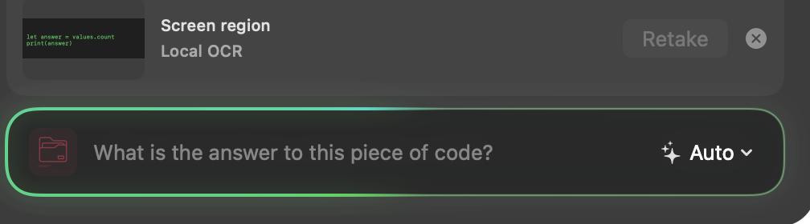
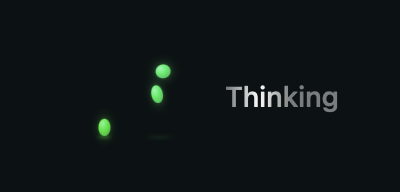

# Thinking, desktop capture, and streaming follow

Implemented against `0f66362` on the current integration branch.

- Streaming updates explicitly notify the native scroll observer. Corrections
  are throttled, so continuous layout updates cannot keep postponing scrolling.
  Scrolling away releases following, and returning to the bottom resumes it.
- `/think` applies to one request. Local and cloud request settings carry the
  intent separately from the displayed question. Local generation reserves
  2,048 tokens instead of 512 and enables the runtime's thinking template with
  a 1,024-token reasoning budget. Preparation includes the extra output space
  and concise checking guidance. File tool loops retain the same setting.
- `/screen` captures all displays and composes them in desktop arrangement.
  `/snapshot` retains the previous interactive selection. Retake preserves the
  capture type. Both use the existing permission, panel-hiding, OCR, privacy,
  cancellation, and temporary-file cleanup paths. Captures remain in memory.
- File Mode is always available; Search and Screen no longer appear as composer
  tool buttons or plus-menu options. Slash commands remain available.
- The supplied SVG is bundled as a data asset (only trailing whitespace normalized). A local, nonpersistent
  WebKit view preserves its authored growth animation at the left of the chat
  until the first visible response text arrives.
  The composer displays a rotating green gradient while a request is active.
  Reduce Motion stops both animations; completion, Stop, and failure remove them.

## Verification

The project build, complete tests, and analyzer are run with the repository's
isolated verification helper: build and analyzer passed; 388 tests completed
with eight optional skips and zero failures. Regression coverage includes command boundaries,
combined commands, desktop versus region capture and retakes, output reservations,
local/cloud thinking settings, nonsticky thinking, file-button visibility, and
scroll updates without observer frame changes. Existing live-scroll, long-chat,
request cancellation, file safety, and capture preservation tests remain intact.

The opt-in installed-model test reads `/tmp/AI-Spotlight-Thinking-Smoke.json`
as a serialized `LocalModel`, without changing the installed library. On the
owner's Google Gemma 4 12B package, `/think` correctly answered the book-and-pen
puzzle (5 kr), and the following ordinary request returned 42. No downloads or
cloud requests were needed. The fixture is removed after verification.

The stable Apple Development-signed app was built and launched from Xcode.
Native accessibility verified the supplied SVG, one visible File Mode button,
and successful Gemma responses. A live response followed at the bottom; scrolling
up during generation released it, and completion did not snap back. `/screen`
attached the desktop without region selection. `/snapshot` invoked the selector;
cancelling restored the draft and previous attachment, which were then cleared.

The existing panel privacy setting excludes it from computer screenshots. The
image below is a cropped native test rendering of the composer glow with synthetic
content; WebKit and the sidebar are separate rendering surfaces and are not
claimed as screenshot-verified. Secondary-display arrangements and live cloud
provider calls were not exercised. GitHub CI results are recorded in the PR.

The exact animation asset:

Provider controls follow the [Claude thinking documentation](https://platform.claude.com/docs/en/build-with-claude/extended-thinking)
and [Gemini thinking documentation](https://ai.google.dev/gemini-api/docs/generate-content/thinking).

The subsequent [chat presentation update](Chat-Presentation.md) adds immediate
outgoing bubbles, Avenir Next typography, and per-message attachments.

## Enigma coalescence and Thinking shimmer

The current waiting indicator uses the supplied `enigma-coalescence.svg`, bundled unchanged as `EnigmaCoalescence`. It replaces the leaf in both empty assistant messages and the standalone pre-response waiting row. A compact “Thinking” label beside it receives a white highlight sweeping left to right every two seconds. The SVG keeps its original eight-second coalescence cycle.

The coalescence animation and text shimmer always run; there is no reduced-motion variant for this indicator. The web view is reused without reloading on ordinary chat updates. Assistive technology receives one “Thinking” status. The composer border animation is unchanged.

Rendering tests verify nonblank SVG pixels, different frames at two animation times, and that the animated group remains visible. The image below is the previous juggle indicator, retained as a historical UI reference.

