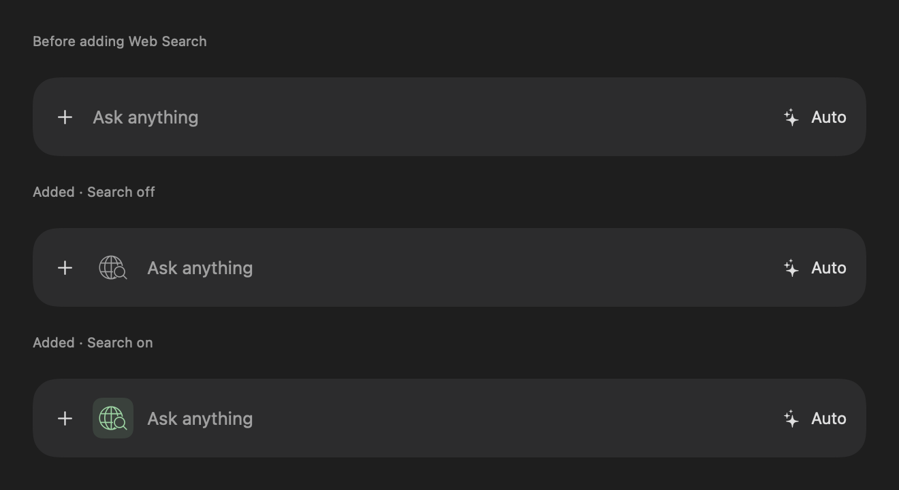

# Web Search

Add a Brave Search API key with **LLM Context** access in **Settings → Web Search · Brave**.
The key is stored in macOS Keychain under a separate search service, never in
preferences or chat history. Brave API usage is separate from model-provider usage.

The search icon starts hidden. Add and enable it with **+ → Web Search** or a
leading **/search** command. It pops into place with a short spring animation as
the text field moves over. Its expanding slot keeps the icon clear of the text
throughout the animation; Reduce Motion disables the spring.

Once added, the icon toggles grey when off and light green when on. Search stays
selected for subsequent messages until turned off. **+ → Remove Web Search**
disables search and hides the icon; a new chat also resets it. The composer keeps
the same height whether the icon is hidden or visible.

This screenshot is an intentional checked-in UI reference; build outputs and test
result bundles remain outside the repository.

In Local mode, Brave receives the current question and the local model generates
the answer. Cloud mode passes the retrieved evidence to the selected provider,
including ChatGPT via the existing Codex bridge. Auto uses the same Brave search
and keeps choosing the model based on task complexity and context size. Merely
mentioning web search in ordinary text does not enable the tool.

Only the current question is sent to Brave, normalized to its 400-character /
50-word query limit. The model still receives the full question. Conversation
history and model credentials are not sent to Brave. Search uses an ephemeral
URLSession with redirects disabled and a 30-second timeout.

The client uses `POST https://api.search.brave.com/res/v1/llm/context` with the
`X-Subscription-Token` header. It supports generic, point-of-interest, and map
grounding entries. Up to five distinct HTTP(S) sources are retained; empty excerpts
and unsafe URLs are discarded. Local requests ask for 1,024 context tokens and
cloud requests ask for 4,096. The selected model's normal context preparation then
fits excerpts into its actual budget, reducing evidence before rejecting a request.
The original question is never truncated to make room for evidence.

Retrieved excerpts are labeled as untrusted data and the model is instructed to
cite exact source URLs. Source links also appear beneath the reply independently
of the model's citation formatting. Only those links/titles and the normal chat
messages are saved; injected excerpts are transient. Existing saved chats remain
compatible. A source link indicates evidence supplied to the model, not independent
verification of every claim in its answer.

Stop cancels both retrieval and generation. Search failures, missing or rejected
keys, rate limits, empty results, and insufficient context preserve the draft and
do not silently produce an answer without search. Error responses are not echoed
into the UI. Search-off requests do not call Brave.

The original icon is in `Icons/noun_WebSearch_199704.svg`; the green derivative is
`Icons/noun_WebSearch_199704_green.svg`. The app bundles a vector image asset using
the same geometry. Attribution is retained in the original, derivative metadata,
and bundled third-party notices.

API reference: [Brave LLM Context](https://api-dashboard.search.brave.com/documentation/services/llm-context).

## Verification

`WebSearchTests` covers the API request/response contract, error handling, query
limits, command parsing, credentials, context fitting, all generation routes,
search-off behavior, cancellation/replacement, history compatibility, and icon
rendering. Tests use deterministic fixtures and do not require a live Brave key.
Run the repository's shared build, test, and analyze commands from `AGENTS.md`.
A live smoke test additionally requires the owner's Brave key and an installed
local model or configured cloud connection.
