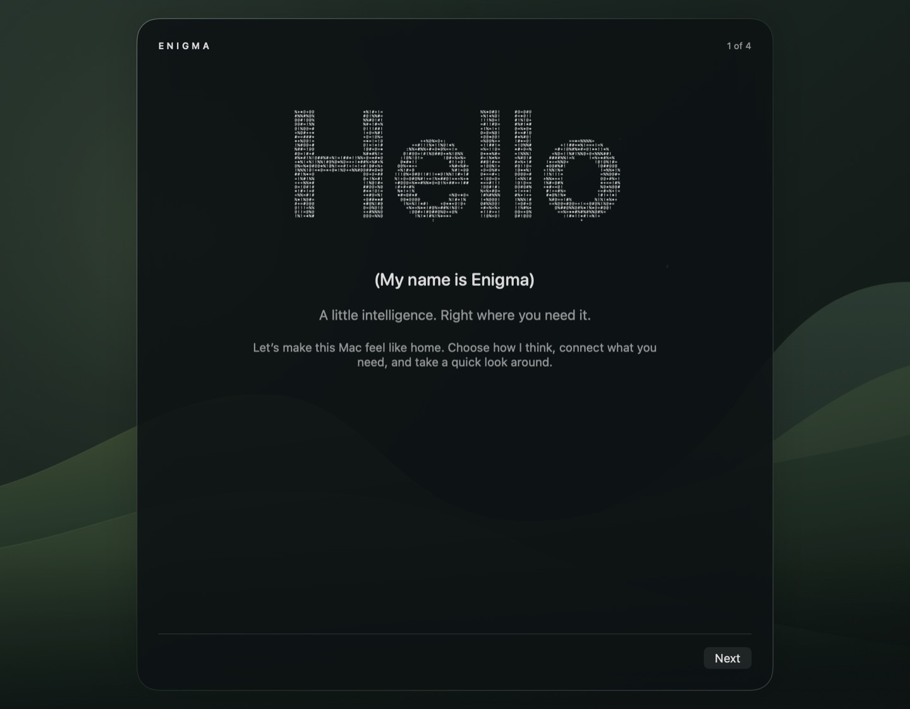
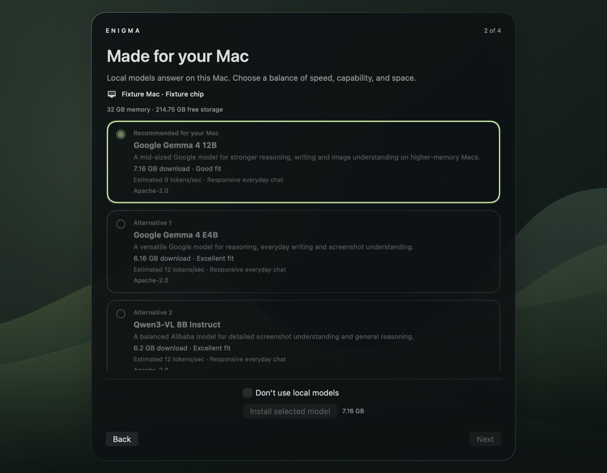
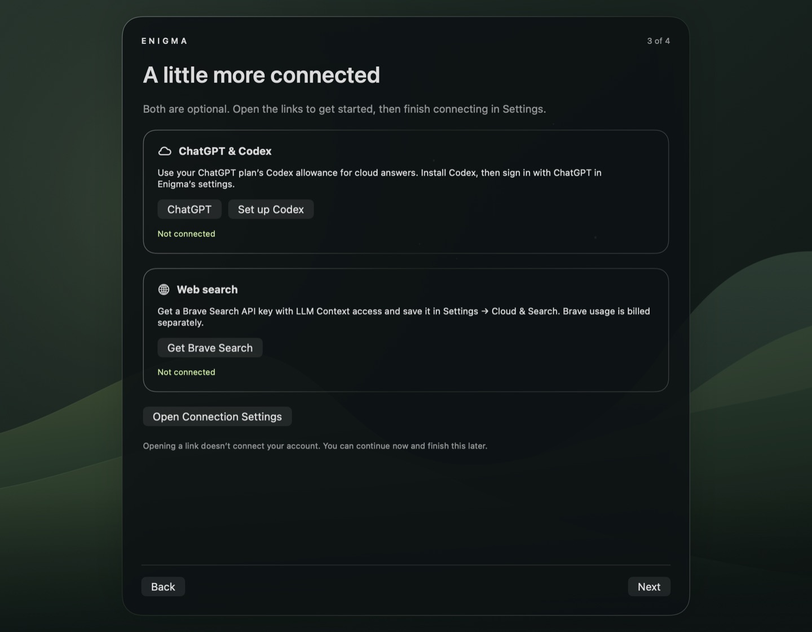
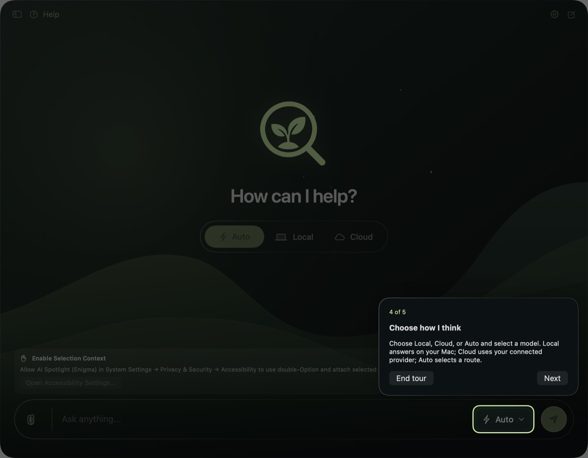

# Welcome setup and walkthrough

First launch introduces Enigma in four steps:

1. **Welcome.** The supplied ASCII Hello characters, column timing, colors, and
   letter wave are rendered natively with SwiftUI Canvas. The loop lasts 8.4
   seconds, stops rendering when the welcome page leaves, and becomes still
   when macOS Reduce Motion is enabled. No web runtime or network is needed.
2. **Your Mac.** Existing hardware detection and the reviewed model catalog supply
   up to three compatible choices. The best choice has a sage border; each card
   explains capability, download size, and estimated or measured responsiveness.
   Unsupported or memory/disk-limited models never pad the list. A slower Mac
   without a responsive choice labels its best available option accordingly.
   Install, opt-out, progress, and Next stay below the scrolling choices.
3. **Connections.** Buttons open [ChatGPT](https://chatgpt.com/), the official
   [Codex installation page](https://learn.chatgpt.com/docs/codex/cli), and
   [Brave Search API](https://brave.com/search/api/). Open Connection Settings
   opens the existing Cloud & Search form with a Back to Setup button. The
   page distinguishes a signed-in account, a saved search key, and missing
   connections. Opening a link does not mark a service as connected. Guides
   can replace or supplement these buttons later. Either service may be deferred.
4. **Walkthrough invitation.** Users can finish immediately or take five short
   steps pointing at chat history, the composer, files, mode/model selection,
   and Help. Next advances, Finish setup returns to chat, and End tour or
   Escape exits early. Popups use the actual SwiftUI control bounds, adapt to
   the minimum panel size, and support the sidebar being shown or hidden.

## Installation and continuation

The welcome flow calls the existing model downloader, checksum verifier, atomic
installer, model selector, and performance check. Next requires the chosen
package to be current, selected, and finished installing. Failure or cancellation
without an installed package leaves Next disabled; the user can retry or opt out.
Cancellation remains busy until the downloader acknowledges it. Canceling a
performance check after the verified package is installed may still leave a
usable model. If a benchmark changes the ranking, the chosen model stays visible
so the user is not asked for a second download.

Choosing **Don’t use local models** bypasses installation and selects Cloud as
the startup mode. Choosing a local model selects Local. Existing model files,
chats, and credentials are retained. No permissions are granted by setup; the
existing Screen, selection, files, and location consent flows remain in place.
The final page explains when no model route has been configured yet.

## First run, resuming, and replaying

An incomplete first run resumes its page after relaunch. Installation and account
status are read from their existing stores; an interrupted model choice must be
confirmed again on the model page. Setup completion persists independently from
whether the optional tour was taken. Existing users who have installed models or
previously dismissed model onboarding are migrated without an unsolicited wizard.

To test in the development app:

1. Run the shared **AI-Spotlight** scheme from Xcode using the usual stable
   development signing identity.
2. Open **Settings → General → Replay Welcome Setup**. This also brings back a
   hidden chat panel. The sidebar's Developer Tools contains the same replay
   action when the sidebar is visible.
3. Walk through the local opt-out path to test without downloading anything.
   On the connections page, open the setup links or Settings, then continue.
4. Choose the walkthrough and use Next through all five stops. Repeat and try
   End tour. Resize the panel down to 640 × 420; scroll the model and connection
   pages to reach additional content.
5. Replay again to exercise a real model install or select an already-installed
   package. Next should unlock only once the selected model is ready. Downloads
   consume the displayed disk space; account login and real searches need your
   participation and credentials.

Replay starts at Hello and does not clear application data or require an account
reset. It is disabled while the shared chat is busy. A replay of previously
completed setup does not force onboarding again on the next launch if abandoned.

## Verification

Offline regression tests in `LocalModelSelectionTests` cover first-run state,
resume, migration, completion, replay, tour progression/exit, three safe unique
choices, keeping the selected choice through reranking, continuation gates,
legacy-sheet suppression, and the bundled character data. Native rendering tests
capture every page and tour step at default and minimum panel sizes, with the
sidebar both hidden and visible. The existing installer tests cover checksum,
truncation, HTTP, disk, cancellation, and preservation of installed models.

Use `scripts/verify-xcode.sh build`, `test`, and `analyze` as specified in AGENTS.md.
These checks do not download multi-gigabyte models, purchase subscriptions, sign
in to real accounts, or send paid search/chat requests. The checked-in screenshots
use deterministic hardware and empty-account fixtures.

Local verification for this feature: build and static analysis passed. The full
suite ran 486 tests with 10 optional skips and no failures; after final viewport
and focus refinements, all 55 affected model-selection and screen-view tests
passed again. Live account authentication and multi-gigabyte downloads remain
manual checks.
